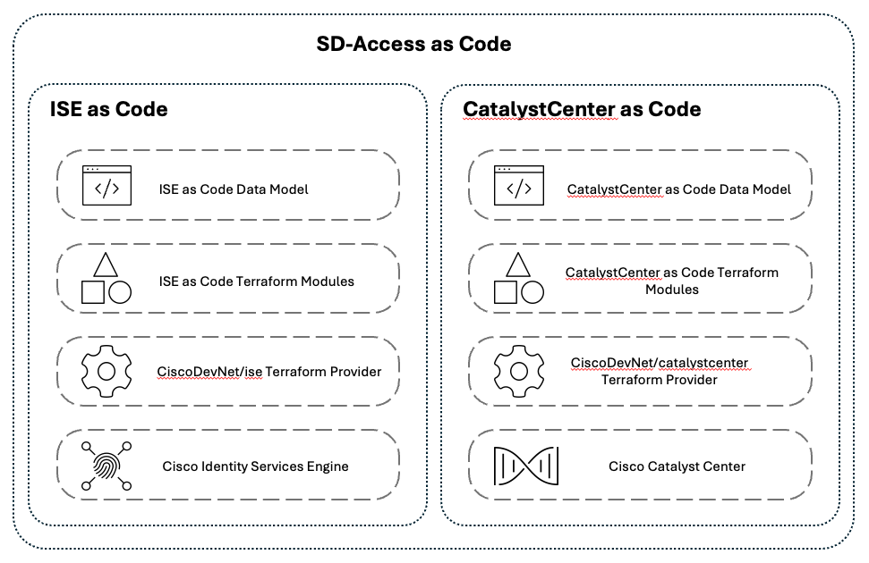

# Introduction

Our modern cloud networking products and controllers have been designed with automation as a top priority. Extensive documentation and a plethora of detailed examples can be found throughout. The goal of this project is to align existing code with best practices, expressed through an easy-to-use, opinionated data model. SD-Access as Code is aimed at users with limited experience with Terraform or those who prefer automating through an inventory-driven approach.

The majority of this project focuses on leveraging this data model-driven approach through HashiCorp Terraform. Terraform is commonly used to define cloud and on-prem resources in human-readable configurations that you can version, reuse, and share.

SD-Access as Code consists of two projects:

- ISE as Code
- CatalystCenter as Code

<figure markdown>
  
</figure>

## CatalystCenter as Code

CatalystCenter as Code allows for complete separation of data (defining variables) from logic (infrastructure declaration). With little to no experience with automation, users can instantiate SDA fabric in minutes. The model is structured in such a way that it logically represents the GUI. It also takes away the complexity of having to deal with references, dependencies or loops. To understand this better, consider the following `main.tf` Terraform plan to create area in Cisco Catalyst Center:

```hcl
resource "catalystcenter_area" "example" {
  name        = "Area1"
  parent_name = "Global"
}
```

The same can be achieved through leveraging the data model for CatalystCenter, following a clean, simple to understand structure:

`area.nac.yaml`:

```yaml
---
catalyst_center:
  sites:
    areas:
      - name: Area1
        parent_name: Global
```

`main.tf`:

```hcl
terraform {
  required_providers {
    catalystcenter = {
      source = "CiscoDevNet/catalystcenter"
    }
  }
}

provider "catalystcenter" {
  username = "admin"
  password = "password"
  url      = "https://cc.url"
}

module "catalyst_center" {
  source  = "netascode/nac-catalystcenter/catalystcenter"
  version = "0.3.0"

  yaml_files = ["area.nac.yaml"]
}
```

## ISE as Code

Cisco ISE as Code follows the same principle as CatalystCenter as Code, providing a complete separation of data (defining variables) from logic (infrastructure declaration). This allows users to easily configure Cisco ISE resources with minimal automation experience. Just like with CatalystCenter, the model is structured to logically represent the Cisco ISE GUI and simplifies the management of complex references, dependencies, or loops.

For example, to configure a Network Access Condition in Cisco ISE you can use following data model file:

`network_access_condition.nac.yaml`:

```yaml
---
ise:
  network_access:
    policy_elements:
      conditions:
        - name: CertificateNotExpired
          type: LibraryConditionAttributes
          is_negate: false
          dictionary_name: CERTIFICATE
          attribute_name: Is Expired
          operator: equals
          attribute_value: "False"
```

`main.tf`:

```hcl
terraform {
  required_providers {
    ise = {
      source  = "CiscoDevNet/ise"
      version = "0.2.12"
    }
  }
}

provider "ise" {
  username = "username"
  password = "password"
  url      = "https://ise.url"
}

module "ise" {
  source  = "netascode/nac-ise/ise"
  version = "0.2.2"

  yaml_files = ["network_access_condition.nac.yaml"]
}
```