# Lab 1 - Design Configuration

This section provides a simple, easy-to-understand example of creating a network hierarchy and IP pools for new or existing deployments. It helps familiarize users with Catalyst Center as Code to manage Catalyst Center. Terraform assumes full control over the life cycle of the resources it creates. This example includes only new sites and IP pools. This approach ensures that any existing Catalyst Center configurations remain unaffected.

The repository used in this lab can be found at: <https://github.com/netascode/nac-catalystcenter-simple-example>

## Getting started

Using the previously established [RDP](rdp://198.18.133.20) session with the **Win10 VM**, start the '**Visual Studio Code**'  { width=40 } application.

When you first open VS Code, you should see the Welcome page with different actions to get started.

Open a new terminal by selecting `Terminal -> New Terminal` from the menu.

<figure markdown>
  { width="500" }
</figure>

In the terminal window type the following command to clone the repository:

```bash
git clone https://github.com/netascode/nac-catalystcenter-simple-example.git
```

Press **Enter** to create your local clone.

```cli
PS C:\Users\admin\Desktop> git clone https://github.com/netascode/nac-catalystcenter-simple-example.git
Cloning into 'nac-catalystcenter-simple-example'...
remote: Enumerating objects: 37, done.
remote: Counting objects: 100% (37/37), done.
remote: Compressing objects: 100% (28/28), done.
remote: Total 37 (delta 13), reused 32 (delta 8), pack-reused 0 (from 0)
Receiving objects: 100% (37/37), 7.65 KiB | 711.00 KiB/s, done.
Resolving deltas: 100% (13/13), done.
```

Then open the newly created folder in "Visual Studio Code".

<figure markdown>
  { width="400" }
</figure>

On the Workspace Trust dialog, select **Yes, I trust the authors** to enable all features in the workspace.

<figure markdown>
  { width="400" }
</figure>

The working area should look like this:

<figure markdown>
  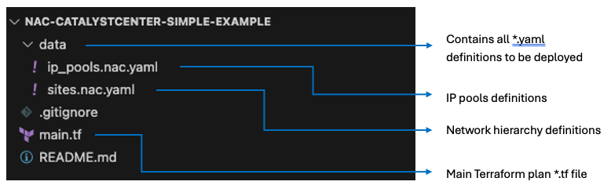{ width="700" }
</figure>

As explained in the introduction, the `main.tf` file contains the required providers, provider settings and points to the location of all *.yaml file definitions.

```hcl
module "catalyst_center" {
  source  = "netascode/nac-catalystcenter/catalystcenter"
  version = "0.3.0"

  yaml_directories = ["data/"]
}
```

## Sites definitions

!!! info "Information Only"
    This section explains the data model structure. No action is required - you can read this to understand how YAML files are organized, or skip directly to Step 1.

An example site's definition is provided in `data/sites.nac.yaml`. This is where the data (variable definition) is abstracted from the logic (infrastructure declaration).

Before diving into this file, it is worth understanding the `*.yaml` files and their structure in the `data` folder a bit better. As different teams might be responsible for different parts of the infrastructure, these definitions need to be flexible. Some organizations might want to use a single `*.yaml` file for their entire network hierarchy, while others prefer a `*.yaml` file per area. The names of the `yaml` files are completely arbitrary. These two examples are explained below:

- **Example 1:** Group multiple areas in the same `*.yaml` file

`multiple_areas.yaml`

```yaml
catalyst_center:
  sites:
    areas:
      - name: Canada
        parent_name: Global
      - name: Poland
        parent_name: Global
```

- **Example 2:** Split the configuration for areas into multiple `*.yaml` files

`emear_areas.yaml`

```yaml
---
catalyst_center:
  sites:
    areas:
      - name: Poland
        parent_name: Global
```

`amer_areas.yaml`

```yaml
---
catalyst_center:
  sites:
    areas:
      - name: Canada
        parent_name: Global
```

Now that you are familiar with the structure, it is time to get into the example.

## Step 1: Sites Validation

This is where the exciting bit starts. Navigate to `data/sites.nac.yaml` and take note of the structure. This example contains five areas, four buildings and six floors.

`sites.nac.yaml`

```yaml
---
catalyst_center:
  sites:
    areas:
      - name: United States
        parent_name: Global
      - name: Golden Hills Campus
        parent_name: Global/United States
      - name: Lakefront Tower
        parent_name: Global/United States
      - name: Oceanfront Mansion
        parent_name: Global/United States
      - name: Desert Oasis Branch
        parent_name: Global/United States
    buildings:
      - name: Sunset Tower
        latitude: 34.099
        longitude: -118.366
        address: 8358 Sunset Blvd, Los Angeles, CA 90069
        country: United States
        parent_name: Global/United States/Golden Hills Campus
        ip_pools_reservations:
          - ST_CORP
          - ST_TECH
          - ST_GUEST
          - ST_BYOD
      - name: Windy City Plaza
        latitude: 41.878
        longitude: -87.630
        address: 233 S Wacker Dr, Chicago, IL 60606
        country: United States
        parent_name: Global/United States/Lakefront Tower
        ip_pools_reservations:
          - WCP_CORP
          - WCP_TECH
          - WCP_GUEST
          - WCP_BYOD
      - name: Art Deco Mansion
        latitude: 25.782
        longitude: -80.133
        address: 123 Ocean Drive, Miami Beach, FL 33139
        country: United States
        parent_name: Global/United States/Oceanfront Mansion
        ip_pools_reservations:
          - ADM_CORP
          - ADM_TECH
          - ADM_GUEST
          - ADM_BYOD
      - name: Desert Oasis Tower
        latitude: 33.448
        longitude: -112.074
        address: 1235 Cactus Ave, Phoenix, AZ 85001
        country: United States
        parent_name: Global/United States/Desert Oasis Branch
        ip_pools_reservations:
          - DOT_CORP
          - DOT_TECH
          - DOT_GUEST
          - DOT_BYOD
    floors:
      - name: FLOOR_1
        floor_number: 1
        parent_name: Global/United States/Golden Hills Campus/Sunset Tower
      - name: FLOOR_2
        floor_number: 2
        parent_name: Global/United States/Golden Hills Campus/Sunset Tower
      - name: FLOOR_1
        floor_number: 1
        parent_name: Global/United States/Lakefront Tower/Windy City Plaza
      - name: FLOOR_2
        floor_number: 2
        parent_name: Global/United States/Lakefront Tower/Windy City Plaza
      - name: FLOOR_1
        floor_number: 1
        parent_name: Global/United States/Oceanfront Mansion/Art Deco Mansion
      - name: FLOOR_1
        floor_number: 1
        parent_name: Global/United States/Desert Oasis Branch/Desert Oasis Tower
```

**Areas**

Each area consists of `name` and `parent_name` attributes. To explore additional attributes available for `areas`, please refer to the [Data Model Documentation](https://netascode.cisco.com/docs/data_models/catalyst_center/sites/area).


**Buildings**

Each building has the following attributes:

- `name` - building name
- `latitude` - building latitude
- `longitude` - building longitude
- `address` - building address
- `country` - country name
- `parent_name` - parent name of that building (site name hierarchy)
- `ip_pools_reservations` - contains a list of IP pools defined in `data/ip_pools.nac.yaml`

To explore additional attributes available for `buildings`, please refer to the [Data Model Documentation](https://netascode.cisco.com/docs/data_models/catalyst_center/sites/building).

**Floors**

Each floor has `name`, `parent_name` and `floor_number` attributes. To explore additional attributes available for `floors`, please refer to the [Data Model Documentation](https://netascode.cisco.com/docs/data_models/catalyst_center/sites/floor).

## Step 2: IP Pools Validation

Navigate to `data/ip_pools.nac.yaml` and take note of the structure. This example contains four IP Pools and sixteen reserved IP Sub pools.

`ip_pools.nac.yaml`

```yaml
---
catalyst_center:
  network_settings:
    ip_pools:
      - name: US_CORP
        ip_address_space: IPv4
        ip_pool_cidr: 10.201.0.0/16
        dhcp_servers:
          - 10.201.0.1
        dns_servers:
          - 10.201.0.1
        ip_pools_reservations:
          - name: DOT_CORP
            prefix_length: 24
            subnet: 10.201.1.0
          - name: ST_CORP
            prefix_length: 24
            subnet: 10.201.2.0
          - name: WCP_CORP
            prefix_length: 24
            subnet: 10.201.3.0
          - name: ADM_CORP
            prefix_length: 24
            subnet: 10.201.4.0
      - name: US_TECH
        ip_address_space: IPv4
        ip_pool_cidr: 10.202.0.0/16
        dhcp_servers:
          - 10.202.0.1
        dns_servers:
          - 10.202.0.1
        ip_pools_reservations:
          - name: DOT_TECH
            prefix_length: 24
            subnet: 10.202.1.0
          - name: ST_TECH
            prefix_length: 24
            subnet: 10.202.2.0
          - name: WCP_TECH
            prefix_length: 24
            subnet: 10.202.3.0
          - name: ADM_TECH
            prefix_length: 24
            subnet: 10.202.4.0
      - name: US_GUEST
        ip_address_space: IPv4
        ip_pool_cidr: 10.203.0.0/16
        dhcp_servers:
          - 10.203.0.1
        dns_servers:
          - 10.203.0.1
        ip_pools_reservations:
          - name: DOT_GUEST
            prefix_length: 24
            subnet: 10.203.1.0
          - name: ST_GUEST
            prefix_length: 24
            subnet: 10.203.2.0
          - name: WCP_GUEST
            prefix_length: 24
            subnet: 10.203.3.0
          - name: ADM_GUEST
            prefix_length: 24
            subnet: 10.203.4.0
      - name: US_BYOD
        ip_address_space: IPv4
        ip_pool_cidr: 10.204.0.0/16
        dhcp_servers:
          - 10.204.0.1
        dns_servers:
          - 10.204.0.1
        ip_pools_reservations:
          - name: DOT_BYOD
            prefix_length: 24
            subnet: 10.204.1.0
          - name: ST_BYOD
            prefix_length: 24
            subnet: 10.204.2.0
          - name: WCP_BYOD
            prefix_length: 24
            subnet: 10.204.3.0
          - name: ADM_BYOD
            prefix_length: 24
            subnet: 10.204.4.0
```

!!! note
    Note that it is possible to alter the content in `sites.nac.yaml` and `ip_pools.nac.yaml` with your own values. The guide will discuss how to make configuration changes in a later step.


## Step 3: Sites and IP Pools Deployment

To deploy sites and IP pools to Catalyst Center, follow these steps:

**1. Edit the `main.tf` file:** Update the provider block with the correct credentials and URL for Catalyst Center.

```hcl
provider "catalystcenter" {
  username    = "admin"
  password    = "C1sco12345"
  url         = "https://198.18.129.100"
  max_timeout = 600
}
```

**2. Save the `main.tf` file:** Use (Ctrl + S) to save your changes.

The next step is to **Initialize Terraform**. This process, executed with the `terraform init` command, prepares your working directory for other Terraform commands by:

- **Configuring the Backend:** Sets up where your Terraform state file will be stored, which can be local or remote.
- **Downloading Provider Plugins:** Retrieves the necessary provider plugins specified in your configuration to interact with various infrastructure APIs.
- **Installing Modules:** Downloads any modules specified in your configuration.
- **Preparing the Directory:** Sets up the directory structure and files needed for managing the Terraform state and configurations.
- **Version Compatibility Check:** Ensures the provider plugins match the specified version constraints for compatibility.

To initialize Terraform, first, open a terminal.

In the Explorer, you can right-click and select **Open in Integrated Terminal**  to open a new terminal from a folder.

<figure markdown>
  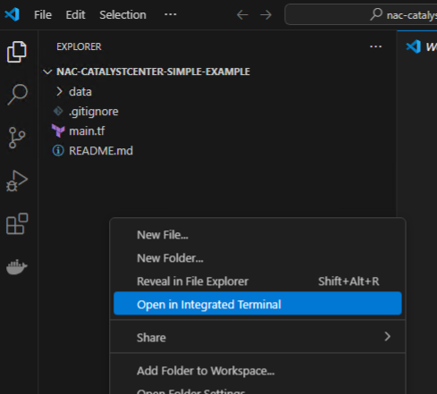{ width="450" }
</figure>

A new PowerShell terminal should open:

<figure markdown>
  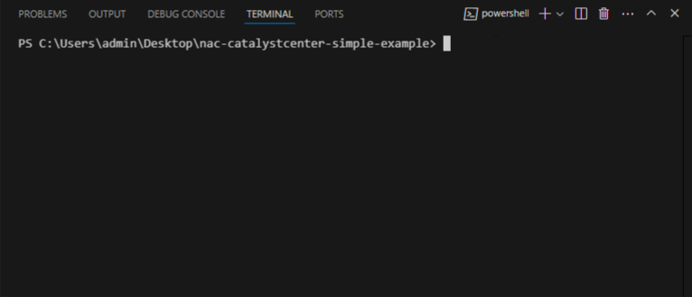{ width="550" }
</figure>


Once the terminal is open, run the following command to initialize Terraform:

```cli
terraform init
```

Upon success you should receive the following output:

<figure markdown>
  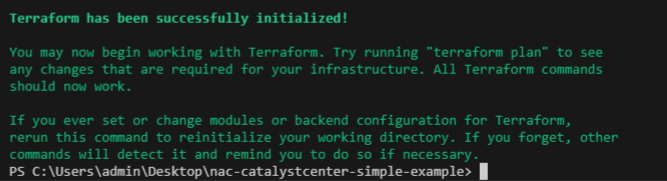{ width="600" }
</figure>

Run `terraform apply` (this applies the changes defined by your Terraform configuration to create, update or destroy resources):

```cli
terraform apply
```

<figure markdown>
  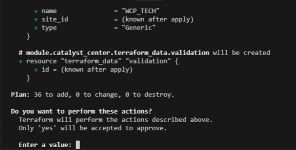{ width="550" }
</figure>

Followed by `yes` to approve.

Upon success you should receive the following output:

<figure markdown>
  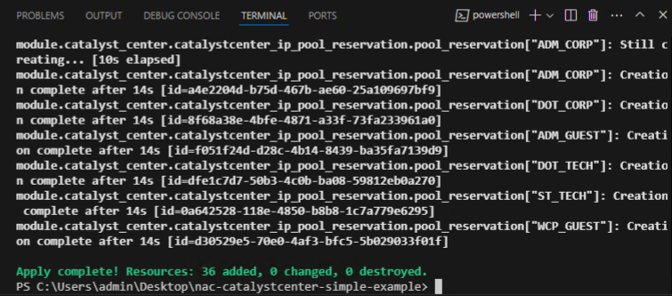{ width="650" }
</figure>


!!! note
    Note that `terraform plan` has been omitted. If you want to preview the changes, you can use this function.

Navigate to your Catalyst Center web GUI and verify that site hierarchy and IP Pools have been deployed successfully.

Open the Chrome web browser and go to the page: [https://198.18.129.100](https://198.18.129.100)

Use the following credentials to log in: `admin/C1sco12345`

Go to `Design` > `Network Hierarchy`
<figure markdown>
  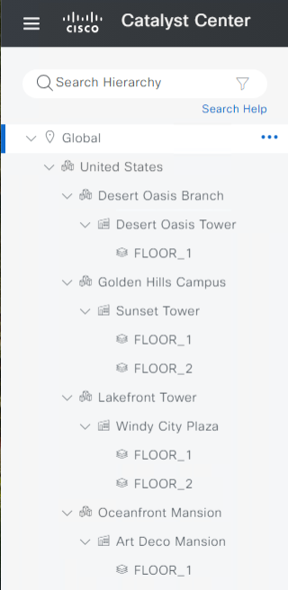{ width="350" }
</figure>

Go to `Design` > `Network Settings` > `IP Address Pools`
<figure markdown>
  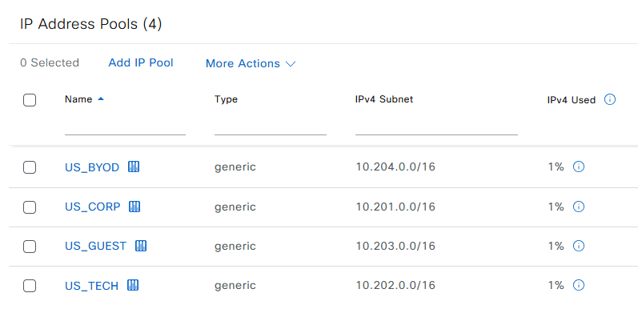{ width="700" }
</figure>

Before expanding on additional use-cases it is worth understanding how you can add and remove resources. This will be covered in [step 4](./#step-4-adding-additional-resources) and [step 5](./#step-5-removing-resources).

## Step 4: Adding additional resources

Now that the sites and IP Pools are deployed, it becomes easy to add additional resources to Sites. Add a new Floor definition to `Art Deco Mansion` building (Global/United States/Oceanfront Mansion/Art Deco Mansion) by adding the following lines to the `floors` section in `sites.nac.yaml`:

```yaml
      - name: FLOOR_2
        floor_number: 2
        height: 4
        parent_name: Global/United States/Oceanfront Mansion/Art Deco Mansion
```

!!! note
    Note that indentation is important here. Make sure the indentation matches with the other floors. You can verify whether your `yaml` is valid by doing a `yaml lint` at [YAML Lint](http://www.yamllint.com/). Simply copy and paste the content of your `*.yaml` file and click `go`.

The `sites.nac.yaml` file with the new floor should look like this:

`sites.nac.yaml`

```yaml
---
catalyst_center:
  sites:
    areas:
      - name: United States
        parent_name: Global
      - name: Golden Hills Campus
        parent_name: Global/United States
      - name: Lakefront Tower
        parent_name: Global/United States
      - name: Oceanfront Mansion
        parent_name: Global/United States
      - name: Desert Oasis Branch
        parent_name: Global/United States
    buildings:
      - name: Sunset Tower
        latitude: 34.099
        longitude: -118.366
        address: 8358 Sunset Blvd, Los Angeles, CA 90069
        country: United States
        parent_name: Global/United States/Golden Hills Campus
        ip_pools_reservations:
          - ST_CORP
          - ST_TECH
          - ST_GUEST
          - ST_BYOD
      - name: Windy City Plaza
        latitude: 41.878
        longitude: -87.630
        address: 233 S Wacker Dr, Chicago, IL 60606
        country: United States
        parent_name: Global/United States/Lakefront Tower
        ip_pools_reservations:
          - WCP_CORP
          - WCP_TECH
          - WCP_GUEST
          - WCP_BYOD
      - name: Art Deco Mansion
        latitude: 25.782
        longitude: -80.133
        address: 123 Ocean Drive, Miami Beach, FL 33139
        country: United States
        parent_name: Global/United States/Oceanfront Mansion
        ip_pools_reservations:
          - ADM_CORP
          - ADM_TECH
          - ADM_GUEST
          - ADM_BYOD
      - name: Desert Oasis Tower
        latitude: 33.448
        longitude: -112.074
        address: 1235 Cactus Ave, Phoenix, AZ 85001
        country: United States
        parent_name: Global/United States/Desert Oasis Branch
        ip_pools_reservations:
          - DOT_CORP
          - DOT_TECH
          - DOT_GUEST
          - DOT_BYOD
    floors:
      - name: FLOOR_1
        floor_number: 1
        parent_name: Global/United States/Golden Hills Campus/Sunset Tower
      - name: FLOOR_2
        floor_number: 2
        parent_name: Global/United States/Golden Hills Campus/Sunset Tower
      - name: FLOOR_1
        floor_number: 1
        parent_name: Global/United States/Lakefront Tower/Windy City Plaza
      - name: FLOOR_2
        floor_number: 2
        parent_name: Global/United States/Lakefront Tower/Windy City Plaza
      - name: FLOOR_1
        floor_number: 1
        parent_name: Global/United States/Oceanfront Mansion/Art Deco Mansion
      - name: FLOOR_1
        floor_number: 1
        parent_name: Global/United States/Desert Oasis Branch/Desert Oasis Tower
      - name: FLOOR_2
        floor_number: 2
        height: 4
        parent_name: Global/United States/Oceanfront Mansion/Art Deco Mansion
```

Save the file (Ctrl + S) and run `terraform apply`

```cli
terraform apply
```

Followed by `yes` to approve.

Terraform will compare the state file with the new plan and calculate any resources that need to be added, changed or destroyed. In this case, one new resource will be created. Terraform will create a new floor under `Art Deco Mansion` building while the existing resources will not be impacted, meaning if you re-execute the existing configuration stays as it is.

<figure markdown>
  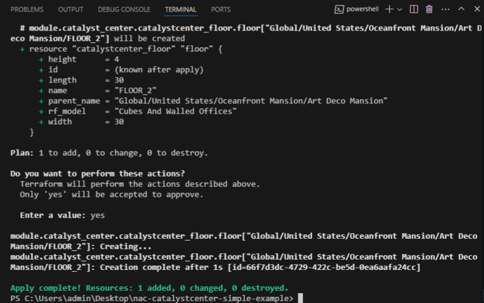{ width="650" }
</figure>

Navigate to Catalyst Center (`Design` > `Network Hierarchy`) and verify that the new floor `FLOOR_2` under `Art Deco Mansion` was added.

<figure markdown>
  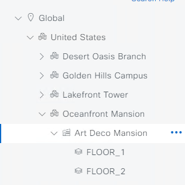{ width="350" }
</figure>

## Step 5: Removing resources

In this step you will remove floor `FLOOR_2` from `Art Deco Mansion`, which was created in [step 4](./#step-4-adding-additional-resources).

Remove the floor `FLOOR_2` section from `sites.nac.yaml`

```yaml
      - name: FLOOR_2
        floor_number: 2
        height: 4
        parent_name: Global/United States/Oceanfront Mansion/Art Deco Mansion
```

The `sites.nac.yaml` file should once again look like this:

```yaml
---
catalyst_center:
  sites:
    areas:
      - name: United States
        parent_name: Global
      - name: Golden Hills Campus
        parent_name: Global/United States
      - name: Lakefront Tower
        parent_name: Global/United States
      - name: Oceanfront Mansion
        parent_name: Global/United States
      - name: Desert Oasis Branch
        parent_name: Global/United States
    buildings:
      - name: Sunset Tower
        latitude: 34.099
        longitude: -118.366
        address: 8358 Sunset Blvd, Los Angeles, CA 90069
        country: United States
        parent_name: Global/United States/Golden Hills Campus
        ip_pools_reservations:
          - ST_CORP
          - ST_TECH
          - ST_GUEST
          - ST_BYOD
      - name: Windy City Plaza
        latitude: 41.878
        longitude: -87.630
        address: 233 S Wacker Dr, Chicago, IL 60606
        country: United States
        parent_name: Global/United States/Lakefront Tower
        ip_pools_reservations:
          - WCP_CORP
          - WCP_TECH
          - WCP_GUEST
          - WCP_BYOD
      - name: Art Deco Mansion
        latitude: 25.782
        longitude: -80.133
        address: 123 Ocean Drive, Miami Beach, FL 33139
        country: United States
        parent_name: Global/United States/Oceanfront Mansion
        ip_pools_reservations:
          - ADM_CORP
          - ADM_TECH
          - ADM_GUEST
          - ADM_BYOD
      - name: Desert Oasis Tower
        latitude: 33.448
        longitude: -112.074
        address: 1235 Cactus Ave, Phoenix, AZ 85001
        country: United States
        parent_name: Global/United States/Desert Oasis Branch
        ip_pools_reservations:
          - DOT_CORP
          - DOT_TECH
          - DOT_GUEST
          - DOT_BYOD
    floors:
      - name: FLOOR_1
        floor_number: 1
        parent_name: Global/United States/Golden Hills Campus/Sunset Tower
      - name: FLOOR_2
        floor_number: 2
        parent_name: Global/United States/Golden Hills Campus/Sunset Tower
      - name: FLOOR_1
        floor_number: 1
        parent_name: Global/United States/Lakefront Tower/Windy City Plaza
      - name: FLOOR_2
        floor_number: 2
        parent_name: Global/United States/Lakefront Tower/Windy City Plaza
      - name: FLOOR_1
        floor_number: 1
        parent_name: Global/United States/Oceanfront Mansion/Art Deco Mansion
      - name: FLOOR_1
        floor_number: 1
        parent_name: Global/United States/Desert Oasis Branch/Desert Oasis Tower
```

Save the file (Ctrl + S) and run `terraform apply`:

```cli
terraform apply
```
Followed by `yes` to approve.

Terraform will compare the state file with the new plan and calculate any resources that need to be added, changed or destroyed. In this case, one resource will be destroyed.

<figure markdown>
  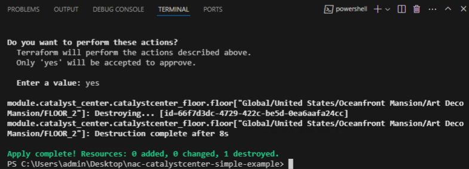{ width="650" }
</figure>

Navigate to the Catalyst Center and verify that the floor `FLOOR_2` has been removed from the building `Art Deco Mansion`

## Step 6: Making changes

You have now added and removed resources, but what if you want to deploy additional configuration settings? For example, how would you change floor length on a Floor? Which attributes can you use, and what values are expected? This is where the [Datamodel Docs](https://netascode.cisco.com/docs/data_models/catalyst_center/overview/) come in. Following the structure of the multiple configuration areas, this section contains a list of all the resources that are currently supported. Under each resource you can find a list of attributes, their type, any constraints, whether they are required and whether they have a default value. It also includes a concise example of how that resource can be configured.

If you go to `Sites` > `Floor`, you'll notice that the length attribute is an integer, as described [here](https://netascode.cisco.com/docs/data_models/catalyst_center/sites/floor). This attribute is optional for this resource and does not have a default value. To modify this setting for a floor, you must explicitly specify this attribute.

Update the `sites.nac.yaml` file by adding the line `length: 20` under floor `FLOOR_1` in the building `Art Deco Mansion`.

```yaml
length: 20
```

The section for `FLOOR_1` should look like this:

```yaml
      - name: FLOOR_1
        floor_number: 1
        parent_name: Global/United States/Oceanfront Mansion/Art Deco Mansion
        length: 20
```

Save the file (Ctrl + S) and run `terraform apply`:

```cli
terraform apply
```

Followed by `yes` to approve.

Terraform will compare the existing state file with the new plan and calculate any resources that need to be added, changed or destroyed. In this case, one resource will be changed. The resource will be updated in-place.

<figure markdown>
  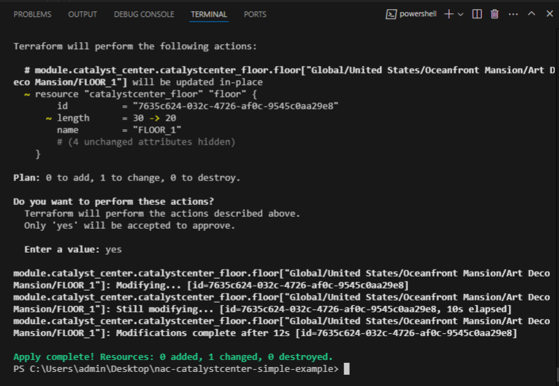{ width="650" }
</figure>

This will update the existing Floor with the new setting for length. Navigate to the Catalyst Center and verify that the floor `FLOOR_1` under `Art Deco Mansion` building was updated with the new `length` configuration.

Go to `Design` > `Network Hierarchy` > `Global` > `United States` > `Oceanfront Mansion` > `Art Deco Mansion` > `FLOOR_1`. Click on `...` and select `View Details`
<figure markdown>
  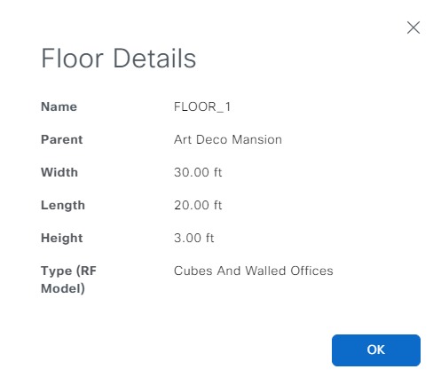{ width="500" }
</figure>

## Step 7: Working with default values

The previous step explained how to modify a setting on a single resource. If you have specific configuration you wish to apply to each instance of that resource you can leverage a `defaults.yaml` file. The `main.tf` plan passes the content of `defaults.yaml` to the module. This allows a user to modify any default settings to reflect their requirements.

Create `defaults.yaml` file inside `data/` folder with following content:

```yaml
---
defaults:
  catalyst_center:
    sites:
      floors:
        length: 20
```

The `defaults.yaml` file follows the same structure as the other `yaml` files in the inventory.

Save the file (Ctrl + S) and run `terraform apply`:

```cli
terraform apply
```

Followed by `yes` to approve.

The output will show that the terraform apply action will update floors with new length.

<figure markdown>
  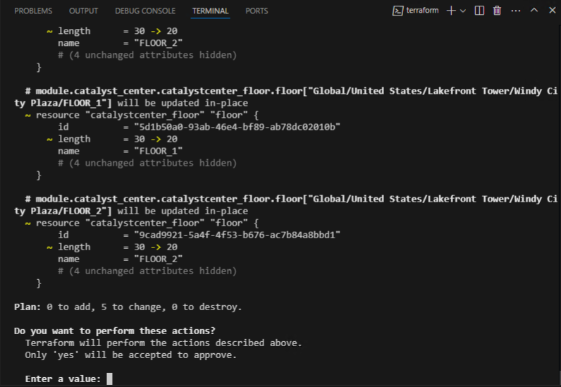{ width="650" }
</figure>

Run `terraform apply` followed by `yes` to approve.

## Step 8: Changing configuration in the GUI

Imagine that someone unaware of the automation efforts makes a change directly in the GUI to one of the objects created by Terraform.

Change floor height to 4ft on `FLOOR_1` in `Desert Oasis Tower` building via the GUI.

Go to `Design` > `Network Hierarchy` > `Global` > `United States` > `Desert Oasis Branch` > `Desert Oasis Tower` > `FLOOR_1`. Click on `...` and select `Edit Floor`

<figure markdown>
  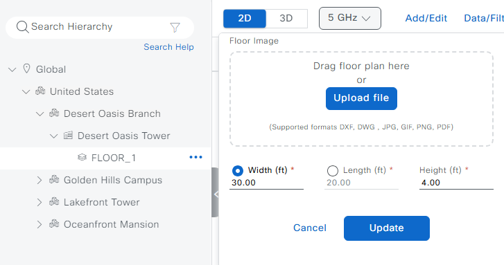{ width="700" }
</figure>

Because the Terraform state now differs from the running configuration a simple `terraform apply` will prompt you to update floor. Terraform can detect configuration drift and reconcile it.

<figure markdown>
  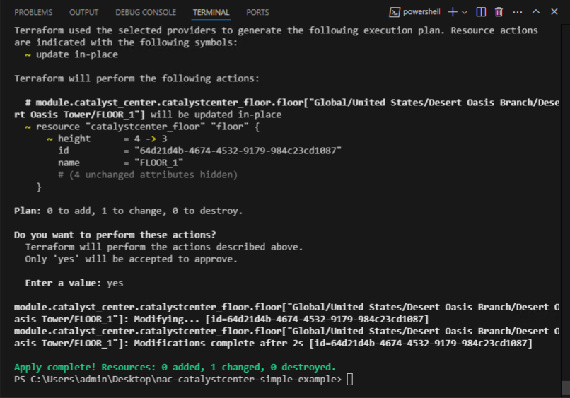{ width="650" }
</figure>

## Step 9: Cleaning up

That is it for this first lab. Feel free to explore additional resources. For a more comprehensive lab you can navigate to the [Lab 2](./lab2_fabric_deployment.md). The final step is to clean up the configuration.

Run `terraform destroy` to remove the configuration:

```cli
terraform destroy
```

Followed by `yes` to approve.

<figure markdown>
  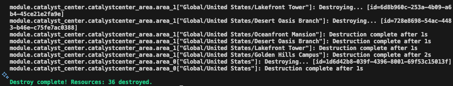{ width="650" }
</figure>


Navigate to Catalyst Center and ensure that IP Pools and Site Hierarchy have been removed.
