# Lab 2 - Fabric Deployment

Catalyst Center as Code for Catalyst Center can be used to instantiate SDA fabric in minutes. An example with a complete Catalyst Center configuration with one border and two edge devices is available at <https://github.com/netascode/nac-catalystcenter-comprehensive-example.git>

```cli
.
├── README.md
├── data
│   ├── devices.nac.yaml
│   ├── fabric.nac.yaml
│   ├── network_profiles.nac.yaml
│   ├── network_settings.nac.yaml
│   ├── sites.nac.yaml
│   ├── templates
│   │   └── ACL_Block.j2
│   └── templates.nac.yaml
└── main.tf
```

## Getting started

In "Visual Studio Code" go to `File -> New Window`, this will open a new Visual Studio Code window.

<figure markdown>
  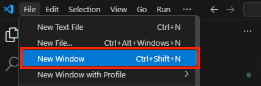{ width="400" }
</figure>

Open a new terminal by selecting `Terminal -> New Terminal` from the menu.

<figure markdown>
  { width="500" }
</figure>

In the terminal window type the following command to clone the repository:

```bash
git clone https://github.com/netascode/nac-catalystcenter-comprehensive-example.git
```

Press **Enter** to create your local clone.

```cli
PS C:\Users\admin\Desktop> git clone https://github.com/netascode/nac-catalystcenter-comprehensive-example.git
Cloning into 'nac-catalystcenter-comprehensive-example'...
remote: Enumerating objects: 74, done.
remote: Counting objects: 100% (74/74), done.
remote: Compressing objects: 100% (49/49), done.
remote: Total 74 (delta 38), reused 55 (delta 21), pack-reused 0 (from 0)
Receiving objects: 100% (74/74), 11.90 KiB | 2.38 MiB/s, done.
Resolving deltas: 100% (38/38), done.
```

Then open the newly created folder in "Visual Studio Code".

<figure markdown>
  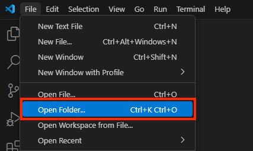{ width="400" }
</figure>

On the Workspace Trust dialog, select **Yes, I trust the authors** to enable all features in the workspace.

## Step 1: Update configuration

Update the `main.tf` file to point to the right Cisco Catalyst Center and ensure the max_timeout setting is adjusted to 600 seconds (10 minutes). The default timeout of 60 seconds might not be sufficient due to the time required for provisioning devices.

```hcl
provider "catalystcenter" {
  username    = "admin"
  password    = "C1sco12345"
  url         = "https://198.18.129.100"
  max_timeout = 600
}
```

!!! note
    In (Lab 1 - Design Configuration) [step 7](./lab1_design_configuration.md#step-7-working-with-default-values) you created a `defaults.yaml` file in `data/` folder to define default values. In this lab we will use the `write_default_values_file` variable in the module block, which saves default values defined in the module to the `defaults.yaml` file.

```hcl
module "catalyst_center" {
  < snipped >

  write_default_values_file = "defaults.yaml"
}
```

Your `main.tf` file should look like this:

```hcl
terraform {
  required_providers {
    catalystcenter = {
      source  = "CiscoDevNet/catalystcenter"
      version = "0.4.6"
    }
  }
}

provider "catalystcenter" {
  username    = "admin"
  password    = "C1sco12345"
  url         = "https://198.18.129.100"
  max_timeout = 600
}

module "catalyst_center" {
  source  = "netascode/nac-catalystcenter/catalystcenter"
  version = "0.3.0"

  yaml_directories      = ["data/"]
  templates_directories = ["data/templates/"]

  use_bulk_api = true

  write_default_values_file = "defaults.yaml"
}
```

In the Explorer, right-click and select **Open in Integrated Terminal**  to open a new terminal from a folder.

<figure markdown>
  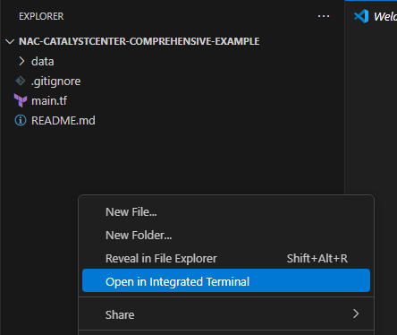{ width="450" }
</figure>

A new PowerShell terminal should open:

<figure markdown>
  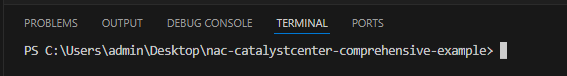{ width="700" }
</figure>


Once the terminal is open, run the following command to initialize Terraform:

```cli
terraform init
```

## Step 2: Base Configuration Deployment

This step involves configuring all necessary settings and configuration on Cisco Catalyst Center prior to provisioning any devices:

- Areas, Building, Floors
- IP Pools
- AAA Network Settings
- Network Profile
- DayN Template
- IP Transit
- Fabric Site
- L3 Virtual Networks
- Anycast Gateways

Take some time to explore all the `*.yaml` files in the `data` directory which constitute a full Catalyst Center configuration.

```cli
├── README.md
├── data
│   ├── devices.nac.yaml
│   ├── fabric.nac.yaml
│   ├── network_profiles.nac.yaml
│   ├── network_settings.nac.yaml
│   ├── sites.nac.yaml
│   ├── templates
│   │   └── ACL_Block.j2
│   └── templates.nac.yaml
└── main.tf
```

**devices.nac.yaml**

Devices inventory with one border device (`BR10`) and two edge devices (`EDGE01` and `EDGE02`), each with the following attributes:

- `name` - device name
- `fqdn_name` - device fqdn hostname
- `device_ip` - management IP address
- `pid` - product ID
- `state` - device state which controls what actions will be performed on devices via Terraform
  The state can be one of the following:
    - `INIT` - no actions will be performed on the devices
    - `PROVISION` - device will be provisioned
    - `REPROVISION` - device will be re-provisioned
    - `PNP` - device will be imported to PNP and claimed
    - `ASSIGN` - device will be assigned to site without provisioning
- `device_role` - device role
- `site` - network location of the device
- `fabric_site` - fabric site for device provisioning
- `fabric_roles` - list of fabric roles of the device

To explore additional attributes available for `devices`, please refer to the [Data Model Documentation](https://netascode.cisco.com/docs/data_models/catalyst_center/inventory/device).

**fabric.nac.yaml**

Defines SDA fabric configurations:

- IP Based Transit: `BGP65002`
- Fabric Site: `Global/Poland/Krakow`
- L3 Virtual Networks:
    - BYOD
    - Guest
    - Printers
    - Campus
- Anycast Gateways for following Pools:
    - CampusVN-IPPool
    - GuestVN-IPPool
    - BYOD-IPPool
    - PrintersVN-IPPool
- Border device `BR10` configuration
- L3 Handoff on `BR10` for `Campus` VN

To explore additional resources available for SDA Fabric, please refer to the [Data Model Documentation](https://netascode.cisco.com/docs/data_models/catalyst_center/fabric/anycast_gateway).

**network_profiles.nac.yaml**

Contains the switching network profile `VirtualCat9k`, network profile site assignment and the `ACL_Block` day-n template attachment.

**network_settings.nac.yaml**

This file includes the `Overlay` IP Pool and four reserved IP sub-pools:

- CampusVN-IPPool
- GuestVN-IPPool
- PrintersVN-IPPool
- BYOD-IPPool

Additionally, it contains AAA Network Settings `AAA_Settings` with ISE Radius servers configured for network_aaa and client_and_endpoint_aaa.

**sites.nac.yaml**

Network hierarchy: (areas, building, floors) with IP Pools and Network Settings assigned to `Krakow` site.

**templates.nac.yaml**

Project `VirtualCat9k` and `ACL_Block` template definitions. The content of the template is stored in the `templates/` directory inside a JINJA file, with the file name `ACL_Block.j2` matching the template name:

`data/templates/ACL_Block.j2`

```cli
ip access-list extended BLOCK_MALICIOUS_IPS
 deny ip any host 123.123.123.123
 deny ip any host 134.134.134.134
 permit ip any any
!
interface {{ interface }}
 ip access-group BLOCK_MALICIOUS_IPS in
```

## Step 3: Apply configuration

Run `terraform apply`

```cli
terraform apply
```

Followed by `yes` to approve.

Upon success you should receive the following output:

<figure markdown>
  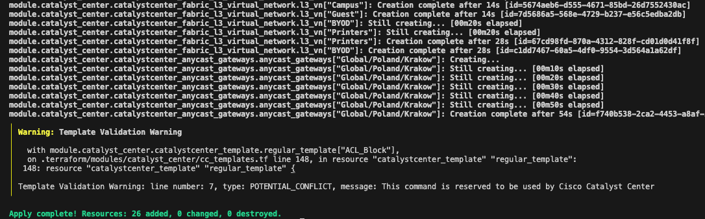
</figure>

Template validation warnings, such as the one shown above, can safely be ignored in this context. These warnings do not prevent the successful application of the template or its intended functionality.

Open Catalyst Center [GUI](https://198.18.129.100) and navigate to `Provision` > `SD-ACCESS`. Select `Virtual Networks` and verify the Layer 3 Virtual Network and Anycast Gateways:

<figure markdown>
  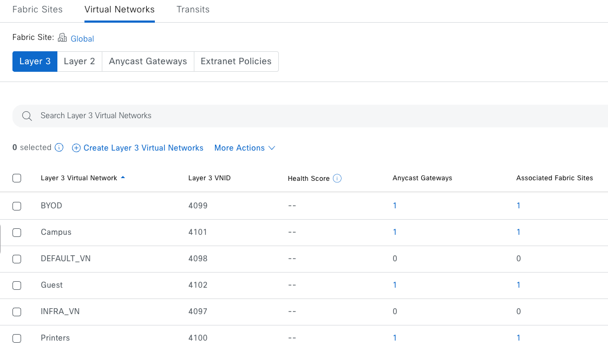{ width="800" }
</figure>

<figure markdown>
  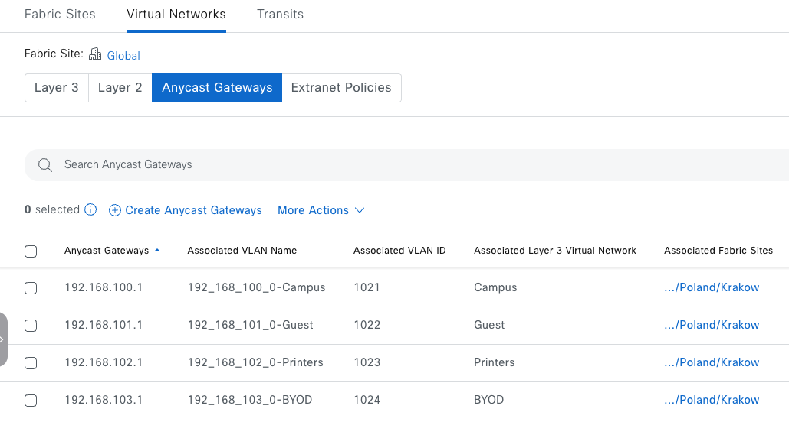{ width="700" }
</figure>

Then select `Transits` and verify IP-Based Transit:

<figure markdown>
  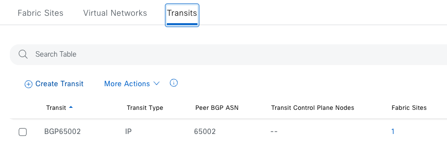{ width="700" }
</figure>

Take some time to explore other sections of the Catalyst Center GUI to check other resources that were created.

## Step 4: Provision Devices

Having the full configuration applied, we can now provision all devices (1 border and 2 edges). To provision devices, open `devices.nac.yaml` file in `data/` folder and change `state` attribute from `INIT` to `PROVISION` on all three devices: `BR10`, `EDGE01`, and `EDGE02`.

```yaml
catalyst_center:
  inventory:
    devices:
      - name: BR10
        hostname: BR10.cisco.eu
        device_ip: 198.18.130.10
        pid: C9KV-UADP-8P
        state: PROVISION
        device_role: BORDER ROUTER
        site: Global/Poland/Krakow/Bld A
        fabric_site: Global/Poland/Krakow
        fabric_roles:
          - BORDER_NODE
          - CONTROL_PLANE_NODE
      - name: EDGE01
        hostname: EDGE01.cisco.eu
        device_ip: 198.18.130.1
        pid: C9KV-UADP-8P
        state: PROVISION
        device_role: ACCESS
        site: Global/Poland/Krakow/Bld A
        fabric_site: Global/Poland/Krakow
        fabric_roles:
          - EDGE_NODE
        port_assignments:
          - interface_name: GigabitEthernet1/0/2
            connected_device_type: "USER_DEVICE"
            data_vlan_name: "192_168_100_0-Campus"
            authenticate_template_name: "No Authentication"
      - name: EDGE02
        hostname: EDGE02.cisco.eu
        device_ip: 198.18.130.2
        pid: C9KV-UADP-8P
        state: PROVISION
        device_role: ACCESS
        site: Global/Poland/Krakow/Bld A
        fabric_site: Global/Poland/Krakow
        fabric_roles:
          - EDGE_NODE
        port_assignments:
          - interface_name: GigabitEthernet1/0/3
            connected_device_type: "USER_DEVICE"
            data_vlan_name: "192_168_100_0-Campus"
            authenticate_template_name: "No Authentication"
```

Save the file (Ctrl + S) and run `terraform plan`

```cli
terraform plan
```

After running `terraform plan` explore which objects/resources Terraform intends to add. Even though we only modify three lines in our YAML file, a total of 9 resources will be created:

```cli
Terraform used the selected providers to generate the following execution plan. Resource actions are indicated with the following symbols:
  + create

Terraform will perform the following actions:

  # module.catalyst_center.catalystcenter_device_role.role["BR10"] will be created
  + resource "catalystcenter_device_role" "role" {
      + device_id   = "e7869917-cf34-44ed-998a-e72ef9866eeb"
      + id          = (known after apply)
      + role        = "BORDER ROUTER"
      + role_source = "MANUAL"
    }

  # module.catalyst_center.catalystcenter_device_role.role["EDGE01"] will be created
  + resource "catalystcenter_device_role" "role" {
      + device_id   = "7ef492ca-b008-479a-9de4-7e40438c7d10"
      + id          = (known after apply)
      + role        = "ACCESS"
      + role_source = "MANUAL"
    }

  # module.catalyst_center.catalystcenter_device_role.role["EDGE02"] will be created
  + resource "catalystcenter_device_role" "role" {
      + device_id   = "024f383c-14a5-421c-b21d-b80910cde422"
      + id          = (known after apply)
      + role        = "ACCESS"
      + role_source = "MANUAL"
    }

  # module.catalyst_center.catalystcenter_fabric_devices.fabric_devices["Global/Poland/Krakow"] will be created
  + resource "catalystcenter_fabric_devices" "fabric_devices" {
      + fabric_devices = [
          + {
              + border_types                   = [
                  + "LAYER_3",
                ]
              + default_exit                   = true
              + device_roles                   = [
                  + "BORDER_NODE",
                  + "CONTROL_PLANE_NODE",
                ]
              + fabric_id                      = "f740b538-2ca2-4453-a8af-56bc161d30ca"
              + id                             = (known after apply)
              + import_external_routes         = false
              + local_autonomous_system_number = "65001"
              + network_device_id              = "e7869917-cf34-44ed-998a-e72ef9866eeb"
            },
          + {
              + device_roles      = [
                  + "EDGE_NODE",
                ]
              + fabric_id         = "f740b538-2ca2-4453-a8af-56bc161d30ca"
              + id                = (known after apply)
              + network_device_id = "024f383c-14a5-421c-b21d-b80910cde422"
            },
          + {
              + device_roles      = [
                  + "EDGE_NODE",
                ]
              + fabric_id         = "f740b538-2ca2-4453-a8af-56bc161d30ca"
              + id                = (known after apply)
              + network_device_id = "7ef492ca-b008-479a-9de4-7e40438c7d10"
            },
        ]
      + fabric_id      = "f740b538-2ca2-4453-a8af-56bc161d30ca"
      + id             = (known after apply)
    }

  # module.catalyst_center.catalystcenter_fabric_l3_handoff_ip_transits.l3_handoff_ip_transits["BR10"] will be created
  + resource "catalystcenter_fabric_l3_handoff_ip_transits" "l3_handoff_ip_transits" {
      + fabric_id         = "f740b538-2ca2-4453-a8af-56bc161d30ca"
      + id                = (known after apply)
      + l3_handoffs       = [
          + {
              + fabric_id            = "f740b538-2ca2-4453-a8af-56bc161d30ca"
              + id                   = (known after apply)
              + interface_name       = "GigabitEthernet1/0/3"
              + local_ip_address     = "172.16.100.1/24"
              + network_device_id    = "e7869917-cf34-44ed-998a-e72ef9866eeb"
              + remote_ip_address    = "172.16.100.2/24"
              + transit_network_id   = "7bbf5ef3-0c5a-4e7a-8f76-2d128ce29fd1"
              + virtual_network_name = "Campus"
              + vlan_id              = 100
            },
        ]
      + network_device_id = "e7869917-cf34-44ed-998a-e72ef9866eeb"
    }

  # module.catalyst_center.catalystcenter_fabric_port_assignments.port_assignments["EDGE01"] will be created
  + resource "catalystcenter_fabric_port_assignments" "port_assignments" {
      + fabric_id         = "f740b538-2ca2-4453-a8af-56bc161d30ca"
      + id                = (known after apply)
      + network_device_id = "7ef492ca-b008-479a-9de4-7e40438c7d10"
      + port_assignments  = [
          + {
              + authenticate_template_name = "No Authentication"
              + connected_device_type      = "USER_DEVICE"
              + data_vlan_name             = "192_168_100_0-Campus"
              + fabric_id                  = "f740b538-2ca2-4453-a8af-56bc161d30ca"
              + id                         = (known after apply)
              + interface_name             = "GigabitEthernet1/0/2"
              + network_device_id          = "7ef492ca-b008-479a-9de4-7e40438c7d10"
            },
        ]
    }

  # module.catalyst_center.catalystcenter_fabric_port_assignments.port_assignments["EDGE02"] will be created
  + resource "catalystcenter_fabric_port_assignments" "port_assignments" {
      + fabric_id         = "f740b538-2ca2-4453-a8af-56bc161d30ca"
      + id                = (known after apply)
      + network_device_id = "024f383c-14a5-421c-b21d-b80910cde422"
      + port_assignments  = [
          + {
              + authenticate_template_name = "No Authentication"
              + connected_device_type      = "USER_DEVICE"
              + data_vlan_name             = "192_168_100_0-Campus"
              + fabric_id                  = "f740b538-2ca2-4453-a8af-56bc161d30ca"
              + id                         = (known after apply)
              + interface_name             = "GigabitEthernet1/0/3"
              + network_device_id          = "024f383c-14a5-421c-b21d-b80910cde422"
            },
        ]
    }

  # module.catalyst_center.catalystcenter_provision_devices.provision_devices["Global/Poland/Krakow/Bld A"] will be created
  + resource "catalystcenter_provision_devices" "provision_devices" {
      + id                = (known after apply)
      + provision_devices = [
          + {
              + id                = (known after apply)
              + network_device_id = "024f383c-14a5-421c-b21d-b80910cde422"
              + reprovision       = false
              + site_id           = "17169f11-e5aa-40c7-b2c8-4fa1f12d1da3"
            },
          + {
              + id                = (known after apply)
              + network_device_id = "7ef492ca-b008-479a-9de4-7e40438c7d10"
              + reprovision       = false
              + site_id           = "17169f11-e5aa-40c7-b2c8-4fa1f12d1da3"
            },
          + {
              + id                = (known after apply)
              + network_device_id = "e7869917-cf34-44ed-998a-e72ef9866eeb"
              + reprovision       = false
              + site_id           = "17169f11-e5aa-40c7-b2c8-4fa1f12d1da3"
            },
        ]
      + site_id           = "17169f11-e5aa-40c7-b2c8-4fa1f12d1da3"
    }

  # module.catalyst_center.time_sleep.provision_device_wait[0] will be created
  + resource "time_sleep" "provision_device_wait" {
      + create_duration = "10s"
      + id              = (known after apply)
    }

Plan: 9 to add, 0 to change, 0 to destroy.
```

1. **Device Roles** (3 resources):

    - `BR10` - BORDER ROUTER role
    - `EDGE01` - ACCESS role
    - `EDGE02` - ACCESS role

2. **Fabric Device Assignments** (1 resource):

    - Assigns fabric roles to all 3 devices: `BR10` (BORDER_NODE, CONTROL_PLANE_NODE), `EDGE01` (EDGE_NODE), `EDGE02` (EDGE_NODE)

3. **L3 Handoff** (1 resource):
    - Creates L3 handoff on `BR10` for Campus Virtual Network via `GigabitEthernet1/0/3`

4. **Port Assignments** (2 resources):
    - `EDGE01` - Port `GigabitEthernet1/0/2` configured for Campus VLAN with "No Authentication"
    - `EDGE02` - Port `GigabitEthernet1/0/3` configured for Campus VLAN with "No Authentication"

5. **Device Provisioning** (1 resource):
    - Provisions all 3 devices to site `Global/Poland/Krakow/Bld A`

6. **Time Sleep** (1 resource):
    - Ensures devices have time to synchronize in the GUI before proceeding

Next, run `terraform apply`

```cli
terraform apply
```

Followed by `yes` to approve.

!!! note
    Device provisioning can take several minutes, so make sure you have max_timeout correctly defined in the provider section of your `main.tf`

After running `terraform apply` confirm that all devices (`BR10`, `EDGE01.cisco.eu`, and `EDGE02.cisco.eu`) were provisioned and are visible in the Catalyst Center GUI.

Go to `Provision` > `SD-ACCESS` > `Fabric Sites`. Select `Krakow` fabric site and select `Fabric Infrastructure` tab.

<figure markdown>
  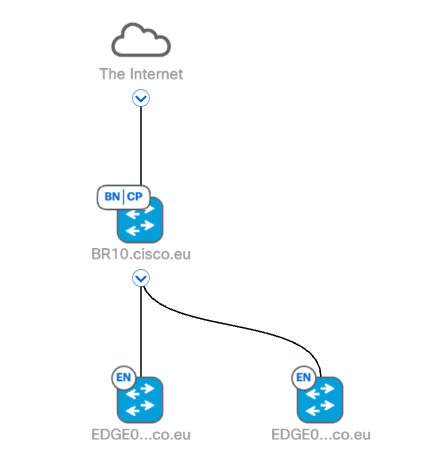
</figure>

Click on `BR10.cisco.eu` icon, select `Fabric` tab and click on Configure:

<figure markdown>
  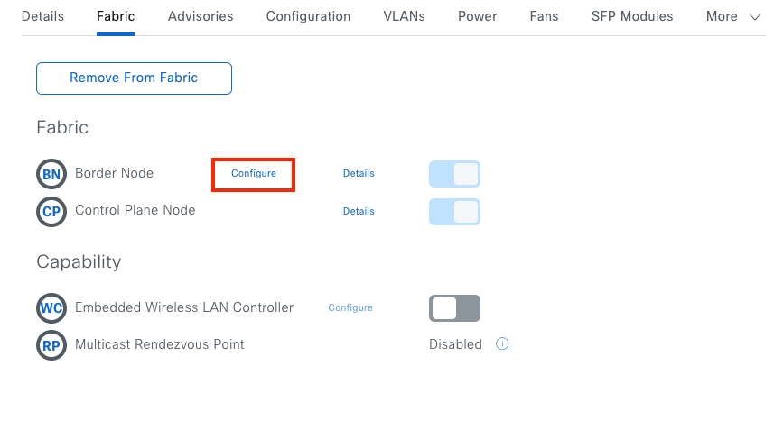{ width="700" }
</figure>

Scroll down and expand `BGP65002` transit, then click on `GigabitEthernet1/0/3` interface under External Interface and verify L3 Handoff:

<figure markdown>
  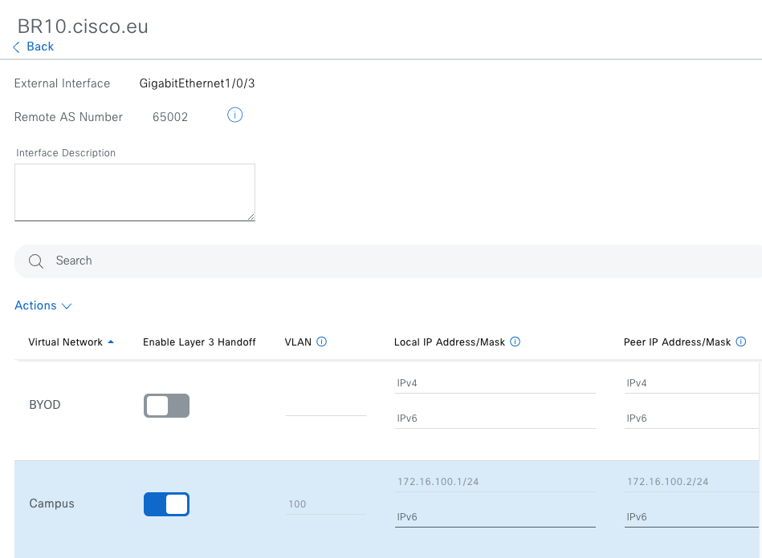{ width="700" }
</figure>

## Step 5: Verify Connectivity

!!! note
    After provisioning, allow some time for the network to stabilize before testing connectivity. If the initial ping fails, wait a few moments and try again

Open web browser and login to Cisco Modeling Labs ([CML](https://198.18.130.34)) using following credentials:

| Device Name | URL | Username	| Password |
|-------------|-----------------|-----------| ----------|
| *Cisco Modeling Lab* | [https://198.18.130.34](https://198.18.130.34) | ```guest``` | ```CiscoLive``` |

Next, click on `SDA-Topo` Lab and open Console on both Hosts: `Host01` and `Host02`.

To open Console, right-click on `Host01` icon and select `Console`

<figure markdown>
  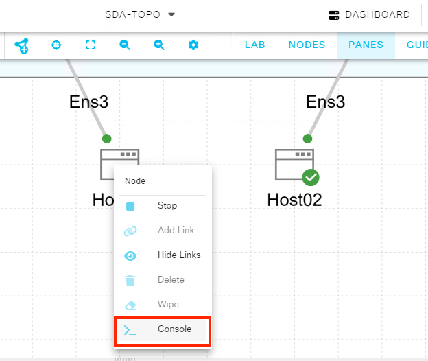{ width="500" }
</figure>

Next click `OPEN CONSOLE`:

<figure markdown>
  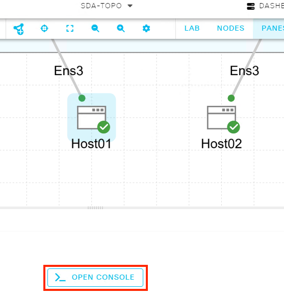{ width="400" }
</figure>

Use following credentials to log in to both hosts:

| Device Name | IP Address |  Username	| Password  |
|-------------|-----------|-----------|-----------|
| *Host1* | 192.168.100.100 |  ```cisco``` | ```cisco``` |
| *Host2* | 192.168.100.200 | ```cisco``` | ```cisco``` |

<figure markdown>
  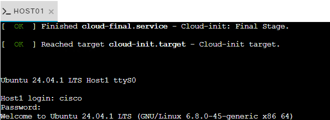{ width="550" }
</figure>

Use the `ping` command on both hosts to check if `192.168.100.1` is reachable from each:

**Host1**

    ```cli
    cisco@Host1:~$ ping 192.168.100.1
    PING 192.168.100.1 (192.168.100.1) 56(84) bytes of data.
    64 bytes from 192.168.100.1: icmp_seq=1 ttl=254 time=37.4 ms
    64 bytes from 192.168.100.1: icmp_seq=2 ttl=254 time=31.9 ms
    64 bytes from 192.168.100.1: icmp_seq=3 ttl=254 time=33.4 ms
    64 bytes from 192.168.100.1: icmp_seq=4 ttl=254 time=27.1 ms
    ^C
    --- 192.168.100.1 ping statistics ---
    4 packets transmitted, 4 received, 0% packet loss, time 3005ms
    rtt min/avg/max/mdev = 27.074/32.458/37.422/3.704 ms
    ```

**Host2**

    ```cli
    cisco@Host2:~$ ping 192.168.100.1
    PING 192.168.100.1 (192.168.100.1) 56(84) bytes of data.
    64 bytes from 192.168.100.1: icmp_seq=1 ttl=254 time=33.7 ms
    64 bytes from 192.168.100.1: icmp_seq=2 ttl=254 time=96.6 ms
    64 bytes from 192.168.100.1: icmp_seq=3 ttl=254 time=27.1 ms
    64 bytes from 192.168.100.1: icmp_seq=4 ttl=254 time=28.6 ms
    ^C
    --- 192.168.100.1 ping statistics ---
    4 packets transmitted, 4 received, 0% packet loss, time 3004ms
    rtt min/avg/max/mdev = 27.078/46.510/96.617/29.032 ms
    ```

To check connectivity between `Host01` and `Host02`, use following `ping` commands:

**Host1**

    ```cli
    cisco@Host1:~$ ping 192.168.100.200
    PING 192.168.100.200 (192.168.100.200) 56(84) bytes of data.
    64 bytes from 192.168.100.200: icmp_seq=1 ttl=64 time=195 ms
    64 bytes from 192.168.100.200: icmp_seq=2 ttl=64 time=132 ms
    64 bytes from 192.168.100.200: icmp_seq=3 ttl=64 time=124 ms
    ^C
    --- 192.168.100.200 ping statistics ---
    3 packets transmitted, 3 received, 0% packet loss, time 2003ms
    rtt min/avg/max/mdev = 124.179/150.641/195.280/31.745 ms
    ```

**Host2**

    ```cli
    cisco@Host2:~$ ping 192.168.100.100
    PING 192.168.100.100 (192.168.100.100) 56(84) bytes of data.
    64 bytes from 192.168.100.100: icmp_seq=1 ttl=64 time=317 ms
    64 bytes from 192.168.100.100: icmp_seq=2 ttl=64 time=116 ms
    64 bytes from 192.168.100.100: icmp_seq=3 ttl=64 time=111 ms
    ^C
    --- 192.168.100.100 ping statistics ---
    3 packets transmitted, 3 received, 0% packet loss, time 2002ms
    rtt min/avg/max/mdev = 111.218/181.502/317.361/96.085 ms
    ```

To test L3 handoff configuration, ping `Loopback8888` interface with IP address `8.8.8.8` on the Fusion Router `EXT1`:

**Host1**

    ```cli
    cisco@Host1:~$ ping 8.8.8.8
    PING 8.8.8.8 (8.8.8.8) 56(84) bytes of data.
    64 bytes from 8.8.8.8: icmp_seq=1 ttl=253 time=79.0 ms
    64 bytes from 8.8.8.8: icmp_seq=2 ttl=253 time=75.3 ms
    64 bytes from 8.8.8.8: icmp_seq=3 ttl=253 time=74.4 ms
    ^C
    --- 8.8.8.8 ping statistics ---
    3 packets transmitted, 3 received, 0% packet loss, time 2003ms
    rtt min/avg/max/mdev = 74.362/76.217/79.004/2.006 ms
    ```

**Host2**

    ```cli
    cisco@Host2:~$ ping 8.8.8.8
    PING 8.8.8.8 (8.8.8.8) 56(84) bytes of data.
    64 bytes from 8.8.8.8: icmp_seq=1 ttl=253 time=86.8 ms
    64 bytes from 8.8.8.8: icmp_seq=2 ttl=253 time=80.1 ms
    64 bytes from 8.8.8.8: icmp_seq=3 ttl=253 time=94.8 ms
    ^C
    --- 8.8.8.8 ping statistics ---
    3 packets transmitted, 3 received, 0% packet loss, time 2003ms
    rtt min/avg/max/mdev = 80.082/87.217/94.778/6.007 ms
    ```

## Step 6: Deploy DayN template

To deploy the `ACL_Block` dayn_template to both edge devices, add the following sections to the `devices.nac.yaml` file under each respective edge device:

For `EDGE01`:

```yaml
        dayn_templates:
          regular:
            - name: ACL_Block
              variables:
                - name: interface
                  value: GigabitEthernet1/0/2
```
For `EDGE02`:

```yaml
        dayn_templates:
          regular:
            - name: ACL_Block
              variables:
                - name: interface
                  value: GigabitEthernet1/0/3
```

After adding the required sections for `EDGE01` and `EDGE02`, your `devices.nac.yaml` file should look like this:

```yaml
      - name: EDGE01
        hostname: EDGE01.cisco.eu
        device_ip: 198.18.130.1
        pid: C9KV-UADP-8P
        state: PROVISION
        device_role: ACCESS
        site: Global/Poland/Krakow/Bld A
        fabric_site: Global/Poland/Krakow
        fabric_roles:
          - EDGE_NODE
        port_assignments:
          - interface_name: GigabitEthernet1/0/2
            connected_device_type: "USER_DEVICE"
            data_vlan_name: "192_168_100_0-Campus"
            authenticate_template_name: "No Authentication"
        dayn_templates:
          regular:
            - name: ACL_Block
              variables:
                - name: interface
                  value: GigabitEthernet1/0/2
      - name: EDGE02
        hostname: EDGE02.cisco.eu
        device_ip: 198.18.130.2
        pid: C9KV-UADP-8P
        state: PROVISION
        device_role: ACCESS
        site: Global/Poland/Krakow/Bld A
        fabric_site: Global/Poland/Krakow
        fabric_roles:
          - EDGE_NODE
        port_assignments:
          - interface_name: GigabitEthernet1/0/3
            connected_device_type: "USER_DEVICE"
            data_vlan_name: "192_168_100_0-Campus"
            authenticate_template_name: "No Authentication"
        dayn_templates:
          regular:
            - name: ACL_Block
              variables:
                - name: interface
                  value: GigabitEthernet1/0/3
```

Run the following command to apply the changes:

```cli
terraform apply
```

Then type `yes` to approve.

<figure markdown>
  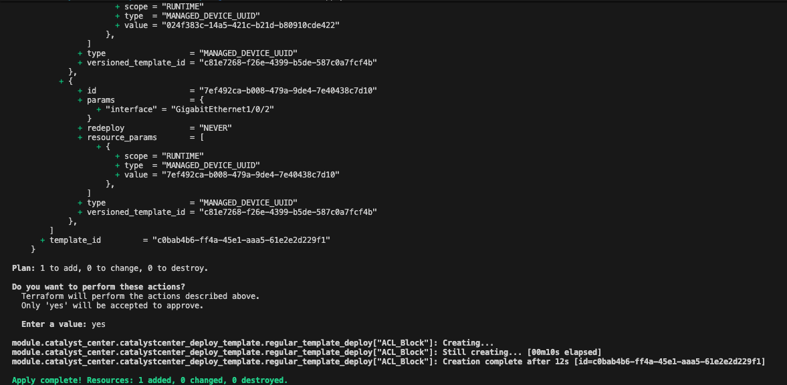{ width="650" }
</figure>

Verify in Catalyst Center GUI that the `ACL_Block` template has been provisioned on both edges. Navigate to `Design` > `CLI Templates`:

<figure markdown>
  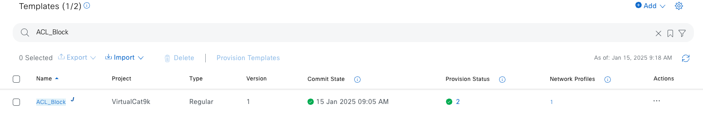
</figure>

Click on the number `2` in the `Provision Status` column.

<figure markdown>
  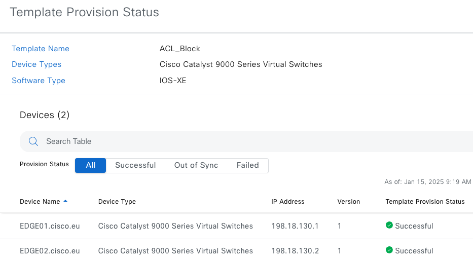
</figure>

You can also verify the template deployment on the edge devices by using `PuTTY` to connect via SSH or by using the CONSOLE in Cisco Modeling Labs ([CML](https://198.18.130.34)).

Use the following credentials to log in to both hosts:

| Device Name | IP Address |  Username	| Password  | Enable Password  |
|-------------|-----------|-----------|-----------|-----------|
| *EDGE01* | 198.18.130.1 |  ```dnacadmin``` | ```C1sco12345``` | ```C1sco12345``` |
| *EDGE02* | 198.18.130.2 |  ```dnacadmin``` | ```C1sco12345``` | ```C1sco12345``` |

On `EDGE01`, execute these commands:

```cli
EDGE01#show access-list BLOCK_MALICIOUS_IPS
Extended IP access list BLOCK_MALICIOUS_IPS
    10 deny ip any host 123.123.123.123
    20 deny ip any host 134.134.134.134
    30 permit ip any any
EDGE01#show run int Gi1/0/2
Building configuration...

Current configuration : 373 bytes
!
interface GigabitEthernet1/0/2
 switchport access vlan 1022
 switchport mode access
 device-tracking attach-policy IPDT_POLICY
 ip access-group BLOCK_MALICIOUS_IPS in
 load-interval 30
 access-session inherit disable interface-template-sticky
 access-session inherit disable autoconf
 no macro auto processing
 spanning-tree portfast
 spanning-tree bpduguard enable
end
```

On `EDGE02`, execute these commands:

```cli
EDGE02#show access-list BLOCK_MALICIOUS_IPS
Extended IP access list BLOCK_MALICIOUS_IPS
    10 deny ip any host 123.123.123.123
    20 deny ip any host 134.134.134.134
    30 permit ip any any
EDGE02#show run int Gi1/0/3
Building configuration...

Current configuration : 373 bytes
!
interface GigabitEthernet1/0/3
 switchport access vlan 1022
 switchport mode access
 device-tracking attach-policy IPDT_POLICY
 ip access-group BLOCK_MALICIOUS_IPS in
 load-interval 30
 access-session inherit disable interface-template-sticky
 access-session inherit disable autoconf
 no macro auto processing
 spanning-tree portfast
 spanning-tree bpduguard enable
end
```
