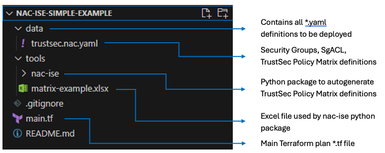
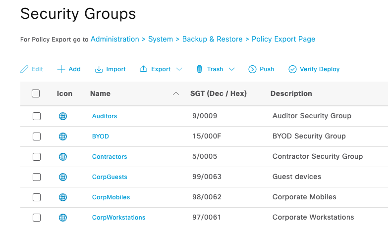
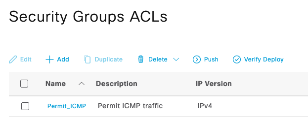
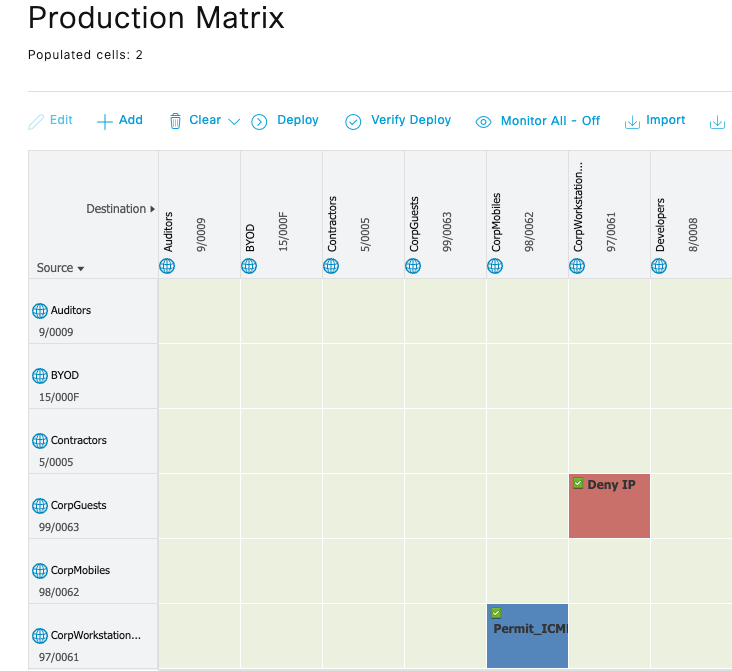
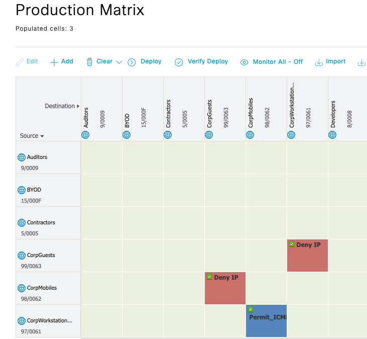
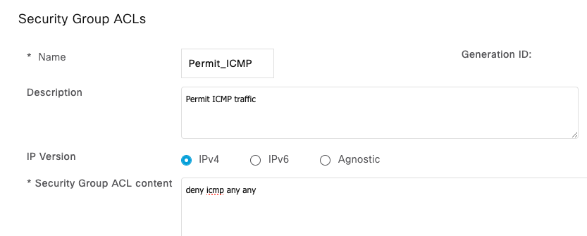
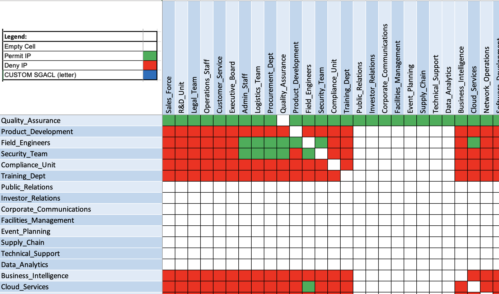
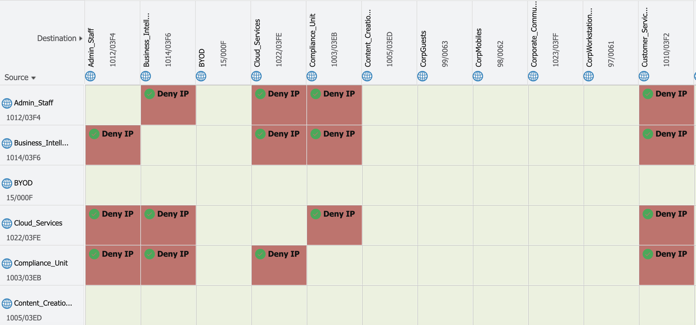

# Lab 3 - ISE Config

This section provides a simple, easy-to-understand example of creating Security Groups and TrustSec Policy Matrix on Cisco ISE. It helps familiarize users with ISE as Code to manage Cisco Identity Services Engine. Because Terraform assumes full control over the lifecycle of the resources it creates, this example includes only new Security Groups, Security Group ACL and TrustSec Policy Matrix, ensuring that any existing Cisco ISE configurations remain unaffected.

The repository used in this lab can be found at: <https://github.com/netascode/nac-ise-simple-example>

## Getting started

In "Visual Studio Code" go to `File -> New Window`, this will open a new Visual Studio Code window.

<figure markdown>
  { width="400" }
</figure>

Open a new terminal by selecting `Terminal -> New Terminal` from the menu.

<figure markdown>
  { width="500" }
</figure>

In the terminal window type the following command to clone the repository:

```bash
git clone https://github.com/netascode/nac-ise-simple-example.git
```

Press **Enter** to create your local clone.

```cli
PS C:\Users\admin\Desktop> git clone https://github.com/netascode/nac-ise-simple-example.git
Cloning into 'nac-ise-simple-example'...
remote: Enumerating objects: 40, done.
remote: Counting objects: 100% (40/40), done.
remote: Compressing objects: 100% (32/32), done.
remote: Total 40 (delta 5), reused 40 (delta 5), pack-reused 0 (from 0)
Receiving objects: 100% (40/40), 49.11 KiB | 1.09 MiB/s, done.
Resolving deltas: 100% (5/5), done.
```

Then open the newly created folder in "Visual Studio Code".

<figure markdown>
  { width="400" }
</figure>

On the Workspace Trust dialog, select **Yes, I trust the authors** to enable all features in the workspace.

<figure markdown>
  { width="400" }
</figure>

The working area should look like this:

<figure markdown>
  { width="700" }
</figure>

As explained in the introduction, the `main.tf` file contains the required providers, provider settings and points to the location of all *.yaml file definitions.

```hcl
module "ise" {
  source  = "netascode/nac-ise/ise"
  version = "0.2.2"

  yaml_directories = ["data/"]
}
```

## TrustSec definition

An example TrustSec Policy Matrix and Security Groups definition are provided in `data/trustsec.nac.yaml`. Navigate to this file and take note of the structure. This example contains three security groups, one security group acl and two trustsec policy matrix entries:

```yaml
---
ise:
  trust_sec:
    security_groups:
      - name: CorpWorkstations
        description: Corporate Workstations
        value: 97
      - name: CorpMobiles
        description: Corporate Mobiles
        value: 98
      - name: CorpGuests
        description: Guest devices
        value: 99
    security_group_acls:
      - name: Permit_ICMP
        description: Permit ICMP traffic
        acl_content: permit icmp any any
    matrix_entries:
      - source_sgt: CorpWorkstations
        destination_sgt: CorpMobiles
        sgacl_name: Permit_ICMP
      - source_sgt: CorpGuests
        destination_sgt: CorpWorkstations
        sgacl_name: Deny IP
```


## Step 1: TrustSec Deployment

Make sure to update the provider block in the `main.tf` file in the root folder with the right credentials and Cisco ISE IP address.

```hcl
provider "ise" {
  username = "admin"
  password = "C1sco12345"
  url      = "https://198.18.133.27"
}
```

Save the file (Ctrl + S).

In the Explorer, right-click and select **Open in Integrated Terminal**  to open a new terminal from a folder.

Once the terminal is open, run the following command to initialize Terraform:

```cli
terraform init
```

Run `terraform apply` (this applies the changes defined by your Terraform configuration to create, update or destroy resources):

```cli
terraform apply
```

Followed by typing `yes` to approve.

Upon success you should receive the following output:

```cli
Apply complete! Resources: 8 added, 0 changed, 0 destroyed.
```

!!! note
    Note that `terraform plan` has been omitted. If you want to preview the changes, you can use this function.

Navigate to your Cisco ISE GUI [link](https://198.18.133.27) and verify that security groups, security group acl and trustsec policy matrix entries have been deployed successfully:

Go to `Work Centers` > `TrustSec` > `Components` > `Security Groups`
<figure markdown>
  { width="600" }
</figure>

Go to `Work Centers` > `TrustSec` > `Components` > `Security Group ACLs`
<figure markdown>
  { width="450" }
</figure>

Go to `Work Centers` > `TrustSec` > `TrustSec Policy` > `Egress Policy` > `Matrix`
<figure markdown>
  { width="600" }
</figure>

Before expanding on additional use-cases it is worth understanding how you can add and remove resources. This will be covered in [step 2](#step-2-adding-additional-resources) and [step 3](#step-3-removing-resources).

## Step 2: Adding additional resources

Now that the TrustSec Policy Matrix is deployed, it becomes easy to add additional entries to that matrix. Add a new matrix entry to block traffic between `CorpMobiles` and `CorpGuests` by adding the following lines to the `matrix_entries` section in `trustsec.nac.yaml`:

```yaml
      - source_sgt: CorpMobiles
        destination_sgt: CorpGuests
        sgacl_name: Deny IP
```

!!! note
    Note that indentation is important here. Make sure the indentation matches with the other entries. You can verify whether your `yaml` is valid by doing a `yaml lint` at [YAML Lint](http://www.yamllint.com/). Simply copy and paste the content of your `*.yaml` file and click `go`.

The `trustsec.nac.yaml` file with the new matrix entry should look like this:

```yaml
---
ise:
  trust_sec:
    security_groups:
      - name: CorpWorkstations
        description: Corporate Workstations
        value: 97
      - name: CorpMobiles
        description: Corporate Mobiles
        value: 98
      - name: CorpGuests
        description: Guest devices
        value: 99
    security_group_acls:
      - name: Permit_ICMP
        description: Permit ICMP traffic
        acl_content: permit icmp any any
    matrix_entries:
      - source_sgt: CorpWorkstations
        destination_sgt: CorpMobiles
        sgacl_name: Permit_ICMP
      - source_sgt: CorpGuests
        destination_sgt: CorpWorkstations
        sgacl_name: Deny IP
      - source_sgt: CorpMobiles
        destination_sgt: CorpGuests
        sgacl_name: Deny IP
```

Save the file (Ctrl + S) and run `terraform apply`

```cli
terraform apply
```

Terraform will compare the state file with the new plan and calculate any resources that need to be added, changed or destroyed. In this case, 1 new resource will be created. Terraform will create a new trustsec policy matrix entry while the existing resources will not be impacted, meaning if you re-execute the existing configuration stays as it is.

Output:

```cli
Plan: 1 to add, 0 to change, 0 to destroy.
```

Followed by `yes` to approve.

Navigate to Cisco ISE GUI [link](https://198.18.133.27) and make sure that the new matrix entry was added.

Go to `Work Centers` > `TrustSec` > `TrustSec Policy` > `Egress Policy` > `Matrix`
<figure markdown>
  { width="600" }
</figure>

## Step 3: Removing resources

In this step you will remove matrix entry `CorpMobiles-CorpGuests`, which was created in [step 2](#step-2-adding-additional-resources).

Remove following section from `trustsec.nac.yaml`

```yaml
      - source_sgt: CorpMobiles
        destination_sgt: CorpGuests
        sgacl_name: Deny IP
```

The `trustsec.nac.yaml` file should once again look like this:

```yaml
---
ise:
  trust_sec:
    security_groups:
      - name: CorpWorkstations
        description: Corporate Workstations
        value: 97
      - name: CorpMobiles
        description: Corporate Mobiles
        value: 98
      - name: CorpGuests
        description: Guest devices
        value: 99
    security_group_acls:
      - name: Permit_ICMP
        description: Permit ICMP traffic
        acl_content: permit icmp any any
    matrix_entries:
      - source_sgt: CorpWorkstations
        destination_sgt: CorpMobiles
        sgacl_name: Permit_ICMP
      - source_sgt: CorpGuests
        destination_sgt: CorpWorkstations
        sgacl_name: Deny IP
```

Save the file (Ctrl + S) and run `terraform apply`:

```cli
terraform apply
```

Terraform will compare the state file with the new plan and calculate any resources that need to be added, changed or destroyed. In this case, 1 resource will be destroyed.

Output:

```cli
Plan: 0 to add, 0 to change, 1 to destroy.
```

Followed by `yes` to approve.

Navigate to Cisco ISE GUI [link](https://198.18.133.27) and make sure that the matrix entry was removed.

## Step 4: Changing configuration in the GUI

Imagine that someone unaware of the automation efforts makes a change directly in the GUI to one of the objects created by Terraform.

Go to `Work Centers` > `TrustSec` > `Components` > `Security Group ACLs`

Change `Permit_ICMP` Security Group ACL content from `permit` to `deny`:

<figure markdown>
  { width="700" }
</figure>

Because the Terraform state now differs from the running configuration a simple `terraform apply` will prompt you to update content of security group acl. Terraform is able to detect configuration drift and reconcile it.

```cli
Terraform will perform the following actions:

  # module.ise.ise_trustsec_security_group_acl.trustsec_security_group_acl["Permit_ICMP"] will be updated in-place
  ~ resource "ise_trustsec_security_group_acl" "trustsec_security_group_acl" {
      ~ acl_content = "deny icmp any any" -> "permit icmp any any"
        id          = "f30ede20-d335-11ef-9ba1-36f45b5da826"
        name        = "Permit_ICMP"
        # (2 unchanged attributes hidden)
    }

Plan: 0 to add, 1 to change, 0 to destroy.
```

Run `terraform apply`:

```cli
terraform apply
```

Followed by `yes` to approve.

## Step 5: AutoGenerate TrustSec Config

Creating TrustSec Policy Entries and Security Groups can be time-consuming, especially if you have many of them in a production environment. In this step, you will generate a new data model file that includes Security Groups, Security Group ACLs, and TrustSec Policy Matrix Entries using the Python tool `nac-ise`. An Excel document will serve as the input for this process.

First open excel file: `matrix-example.xlsx` located in `tools/` folder and review content.

!!! note
    Note that LibreOffice is installed on the Windows VM

The Excel file consists of two sheets:

- `Matrix` Sheet:
    - Represents the TrustSec policy matrix, defining permissions between Security Groups.
    - Cell Colors and Their Meanings:
        - **Green**: `Permit IP` – Allows all IP traffic between the corresponding Security Groups
        - **Red**: `Deny IP` – Blocks all IP traffic between the corresponding Security Groups
        - **Blue with a Letter**: `Custom SGACL` - Represents a custom Security Group Access Control List (SGACL). The specific SGACL is defined in the `CUSTOM SGACL` sheet
    - `CUSTOM SGACL` Sheet:
        - Contains the definitions for custom SGACLs referenced in the `Matrix` sheet
        - Each SGACL is identified by a unique letter or identifier used in the `Matrix` sheet

<figure markdown>
  { width="800" }
</figure>

Either use the table as it is or modify the Matrix sheet by changing cell colors, adding/removing source and destination Security Groups as needed.

Next, you need to install nac-ise package. To install `nac-ise` navigate to `tools/nac-ise/` folder using terminal:


```cli
PS C:\Users\admin\Desktop\nac-ise-simple-example> cd tools
PS C:\Users\admin\Desktop\nac-ise-simple-example\tools> cd nac-ise
PS C:\Users\admin\Desktop\nac-ise-simple-example\tools\nac-ise>
```

and execute following command:

```cli
pip install .
```

After installation, you can run the tool directly from the command line:

```cli
nac-ise --help
usage: nac-ise [-h] {import-matrix} ...

positional arguments:
  {import-matrix}  commands help
    import-matrix  Import matrix from an input file and export to an output file

options:
  -h, --help       show this help message and exit
```

To generate new data model file `autogen_matrix.nac.yaml` run nac-ise tool with following arguments:

```cli
nac-ise import-matrix --input "<EXCEL FILE>" --output "<DATA MODEL YAML FILE>"
```

```cli
nac-ise import-matrix --input ..\matrix-example.xlsx --output ..\..\data\autogen_matrix.nac.yaml
```

!!! note
    Ensure you're in the correct directory: `C:\Users\admin\Desktop\nac-ise-simple-example\tools\nac-ise>`. If you run the command from a different location, adjust the `--input` and `--output` paths accordingly.

After that, take some time to review content of the newly created `autogen_matrix.nac.yaml` file inside the `data/` folder. It will contain all TrustSec Policy Matrix Entries, Security Group ACLs and Security Groups defined in `matrix-example.xlsx` file.

## Step 6: AutoGenerate TrustSec Deployment

Navigate to `nac-ise-simple-example/` folder:

```cli
PS C:\Users\admin\Desktop\nac-ise-simple-example\tools\nac-ise> cd ..
PS C:\Users\admin\Desktop\nac-ise-simple-example\tools> cd ..
PS C:\Users\admin\Desktop\nac-ise-simple-example>
```

Run `terraform apply`:

```cli
terraform apply
```

Followed by `yes` to approve.

Upon success you should receive the following output:

```cli
Apply complete! Resources: 716 added, 0 changed, 0 destroyed.
```

Navigate to Cisco ISE to review the newly created matrix entries.

Go to `Work Centers` > `TrustSec` > `TrustSec Policy` > `Egress Policy` > `Matrix`

<figure markdown>
  { width="700" }
</figure>

## Step 7: Cleaning up

That is it for this lab. Feel free to experiment with additional resources based on data model [Documentation](https://netascode.cisco.com/docs/data_models/ise/overview). The final step is to clean up the configuration.

Run `terraform destroy` to remove the configuration:

```cli
terraform destroy
```

Output:

```cli
Plan: 0 to add, 0 to change, 724 to destroy.
```

Followed by `yes` to approve.

Next, navigate to Cisco ISE GUI [link](https://198.18.133.27) and verify that the TrustSec Policy Matrix, Security Group ACLs and Security Groups have been removed.

!!! important
    **Before proceeding with the next lab ([Lab 4 - CICD Integration](./lab4_cicd.md)), ensure that all configurations have been completely removed. This step is critical to avoid conflicts or issues during subsequent labs.**
