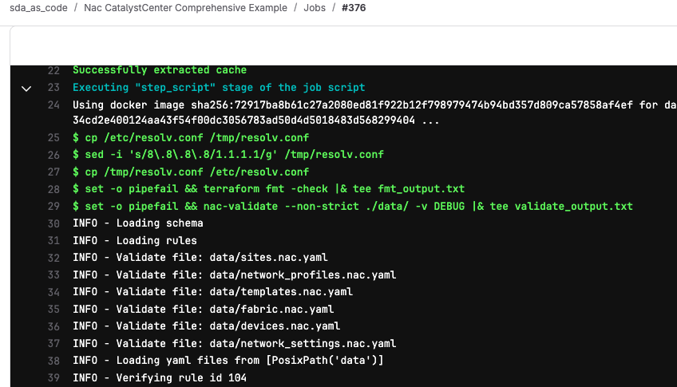
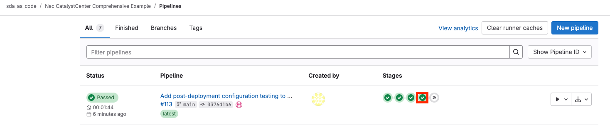
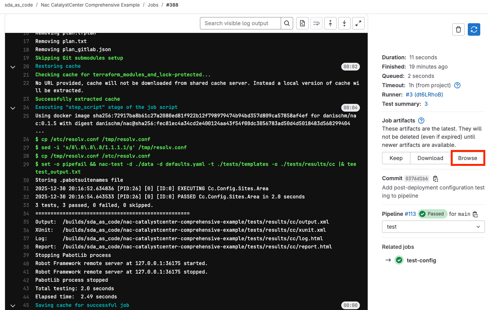
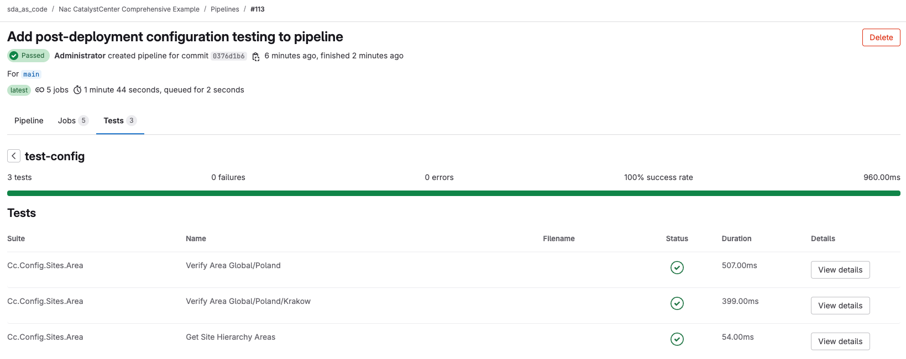

# Lab 5 - Validations

This section explores several areas that can be used to improve the quality of programmatic changes. These areas are well-established concepts in the software development world, and apply to Infrastructure as Code in a similar fashion. It is worth noting that many of these areas are addressed in commercial offers from Cisco. That being said, a plethora of open-source tools are available to help users develop their own validations. This lab will explore these options.

## Step 1: Linting

To improve the quality of your code it is recommended to verify that the meaning of user input is both valid and meaningful. This means ensuring that all user input is relevant, accurate, and appropriate for the intended purpose.

Linting is the process of analyzing code for programmatic and stylistic errors. It helps to identify potential issues such as syntax errors, missing semicolons, excessive whitespace, and formatting inconsistencies. Linting can help make sure that code follows a standard style and complies with best practices, making it easier to read and debug. By automating certain parts of the process, linting can help developers save time and write better quality code.

There are many ways to lint code, from online tools such as [yamllint.com](https://yamllint.com) that lets users copy & paste code, or the more commonly used CLI-driven tools. A common linter for `yaml` is the `yamllint` Python package, which can be installed through:

```cli
pip install yamllint
```

`yamllint` is also packaged for all major operating systems, see installation examples (dnf, apt-get...) in the [documentation](https://yamllint.readthedocs.io/en/stable/quickstart.html).

Running `yamllint .` within a directory will lint all `*.yaml` files and show any errors.

Here is an example:

```
yamllint .                                                         %
.\data\ip_pools.nac.yaml
  1:4       error    wrong new line character: expected \n  (new-lines)

.\data\sites.nac.yaml
  1:4       error    wrong new line character: expected \n  (new-lines)
  74:81     error    no new line character at the end of file  (new-line-at-end-of-file)
```

Note that if you run this from a directory that has the NAC terraform modules downloaded (for example after a `terraform init`), `yamllint` will lint all files, recursively. This means it will also lint any `yaml` files in the `.terraform` directory. You can exclude files by creating a new configuration file `.yamllint`:

```cli
PS C:\Users\admin\Desktop\nac-catalystcenter-comprehensive-example> ni .yamllint
```

with following content:

```yaml
---
extends: default

yaml-files:
  - '*.yaml'
  - '*.yml'
  - '.yamllint'

ignore: |
  .terraform

rules:
  new-lines:
    type: dos

```

!!! note
    If you are working on a Windows Machine, use rule to force the type of new line characters

Run `yamllint` in `nac-catalystcenter-comprehensive-example` repository folder you created in [Lab 2 - Fabric Deployment](./lab2_fabric_deployment.md)

```sh
PS C:\Users\admin\Desktop\nac-catalystcenter-comprehensive-example> yamllint data/
```

!!! note
    There should be no errors in yaml files in the `data` folder, if you have errors then fix them before proceeding with next steps.

When using a git repository, it is advised to include these steps in a pre-commit hook. This is a client side action that will run each time that you commit a change. To do that you can create a `.pre-commit-config.yaml` file. Note that it is possible to write your own scripts but one of the advantages of `pre-commit` is that you can leverage a large ecosystem of hooks made by other people. Many other examples for `pre-commit` can be found at [https://pre-commit.com/hooks.html](https://pre-commit.com/hooks.html).

Navigate to the `nac-catalystcenter-comprehensive-example` folder and create `.pre-commit-config.yaml` with the following content:

```yaml
repos:
- repo: https://github.com/adrienverge/yamllint.git
  rev: v1.28.0
  hooks:
    - id: yamllint
      files: ^data/.*\.(yml|yaml)$
```

```cli
PS C:\Users\admin\Desktop\nac-catalystcenter-comprehensive-example\data> cd ..
PS C:\Users\admin\Desktop\nac-catalystcenter-comprehensive-example> ni .pre-commit-config.yaml
```

To make use of this configuration, you must first install and initialize `pre-commit`:

```cli
pip install pre-commit
pre-commit install
pre-commit installed at .git/hooks/pre-commit
```

!!! note
    Note that the `pre-commit install` must be run from the root of the repository.

And make sure to add `.pre-commit-config.yaml` with `git add`:

```cli
git add .pre-commit-config.yaml
```

The next time you run `git commit`, the hook will initiate `yamllint`:

```cli
git commit -m "updating configuration"
yamllint.............................................(no files to check)Skipped
[main ef960d8] updating configuration
 1 file changed, 0 insertions(+), 0 deletions(-)
 create mode 100644 .pre-commit-config.yaml
```

!!! note
    Note that the `yamllint` pre-commit hook runs only on files in the staging area. To detect linting issues in your YAML files, you need to edit the files, add them to the staging area, and then commit the changes

Let's intentionally introduce some linting issues in the `sites.nac.yaml` file by adding random spaces. Save the file, add it to Git, and attempt to commit:

```cli
git add .
git commit -m "sites.nac.yaml modifications"
yamllint.................................................................Failed
- hook id: yamllint
- exit code: 1

data/sites.nac.yaml
  4:6       error    wrong indentation: expected 4 but found 5  (indentation)
  5:7       error    wrong indentation: expected 7 but found 6  (indentation)
  9:8       error    syntax error: expected <block end>, but found '<block sequence start>' (syntax)     
  10:9      error    wrong indentation: expected 9 but found 8  (indentation)
  12:9      error    wrong indentation: expected 9 but found 8  (indentation)
  15:5      error    wrong indentation: expected 2 but found 4  (indentation)
```

As you can see, the pre-commit hook prevents committing changes that contain linting errors. This is helpful for catching human errors in YAML syntax before they are committed to the repository.

Fix the linting errors you introduced before proceeding with Semantic and Syntactic Validation.

!!! note
    There should be no errors in yaml files in the `data` folder, if you have errors then fix them before proceeding with next steps.

The downside of pre-commit hooks is that they run exclusively on your system. If a contributor to your project does not have the same hooks installed, they may commit code that violates your pre-commit hooks. If you use GitHub, you can integrate pre-commit hooks in your CI workflow. At the moment of writing, this is only available for GitHub. Visit [https://pre-commit.com](https://pre-commit.com) for more information. For GitLab CI users it is possible to run a job to check whether the pre-commit hooks were properly applied. Below is an example of adding a linting stage to your `.gitlab-ci.yml`. **This step will not be explored further, and there is no need to add it to your GitLab CI file.**

```yaml
yamllint:
  stage: linting
  image: registry.gitlab.com/pipeline-components/yamllint:latest
  script:
    - yamllint data/
```

## Step 2: Semantic and Syntactic Validation

Semantic validation is the process of checking the meaning of data to ensure accuracy and correctness. This can involve validating data against a set of rules, making sure it conforms to certain expectations. Syntactic validation is the process of validating data against a set of predetermined rules. This ensures that information entered into a system meets the requirements for it to be accepted and processed correctly. Syntactic validation can involve using regular expressions to check for specific patterns, or comparison operators to check if values meet certain criteria.

The open-source `nac-validate` Python tool can be used to perform syntactic and semantic validation of YAML files. Syntactic validation is done by basic YAML syntax validation (e.g., indentation) and by providing a [Yamale](https://github.com/23andMe/Yamale) schema and validating all YAML files against that schema. Semantic validation is done by providing a set of rules (implemented in Python) which are then validated against the YAML data. Every rule is implemented as a Python class and should be placed in a `.py` file located in the `--rules` path.

Each `.py` file must have a single class named `Rule`. This class must have the following attributes: `id`, `description`, and `severity`. It must implement a `classmethod()` named `match` that has a single function argument data which is the data read from all YAML files. It should return a list of strings, one for each rule violation with a descriptive message. For the purpose of this lab, several scripts have already been shared with you in the repository.

Python 3.10+ is required to install nac-validate. It can be installed using pip:

```cli
pip install nac-validate==1.0.0
```

!!! note
    Note that `nac-validate` has already been installed on your lab workstation.

It may also be integrated via a pre-commit hook with the following `.pre-commit-config.yaml`, assuming the default values are used (`.schema.yaml`, `.rules/`).

```yaml
repos:
- repo: https://github.com/netascode/nac-validate
  rev: v1.0.0
  hooks:
    - id: nac-validate
      args:
        - '--non-strict'
```

In case the schema or validation rules are located somewhere else, the required CLI arguments can be added like this:

```yaml
repos:
  - repo: https://github.com/netascode/nac-validate
    rev: v1.0.0
    hooks:
      - id: nac-validate
        args:
          - '--non-strict'
          - '-s'
          - 'my_schema.yaml'
          - '-r'
          - 'rules/'
```

An example `.schema.yaml` can be found [here](https://github.com/netascode/nac-catalystcenter-validate).

!!! info "Cisco Services as Code"
    The `.schema.yaml` file used in this lab is a partial schema provided as an example for learning purposes. A comprehensive, production-ready schema covering all CatalystCenter resources, along with an extensive library of pre-built validation rules, is available as part of Cisco's **Services as Code** commercial offering. This enterprise solution provides complete validation coverage, ongoing updates, and professional support to ensure your infrastructure as code implementations meet the highest standards.

Copy the `.schema.yaml` file from this repository to your `nac-catalystcenter-comprehensive-example` repository.

Commit the `.schema.yaml` file to your repository:

```cli
git add .schema.yaml
git commit -m "Add schema validation file"
```

Run command `nac-validate --non-strict data/ -v DEBUG` to check if the files in the data folder are syntactically correct:

```cli
nac-validate --non-strict data/ -v DEBUG
```

In the output, you should see INFO logs showing that the schema was loaded and all files that were validated against that schema:

Output without any errors means that everything matches the schema and there are no syntax errors.

```sh
INFO - Loading schema
INFO - No rules found
INFO - Validate file: data/network_settings.nac.yaml
INFO - Validate file: data/fabric.nac.yaml
INFO - Validate file: data/templates.nac.yaml
INFO - Validate file: data/sites.nac.yaml
INFO - Validate file: data/devices.nac.yaml
INFO - Validate file: data/network_profiles.nac.yaml
```

Now, let's modify the `.schema.yaml` file to make the `address` setting under `site_buildings` a mandatory attribute by removing `required=False`.

```yaml
site_buildings:
  name: str()
  parent_name: str()
  latitude: num(required=False)
  longitude: num(required=False)
  address: str()
  country: str(required=False)
  ip_pools_reservations: list(str(), required=False)
```

If the address is not provided for a building, the validation will fail:

```cli
nac-validate --non-strict data/ -v DEBUG
INFO - Loading schema
INFO - No rules found
INFO - Validate file: data/network_settings.nac.yaml
INFO - Validate file: data/fabric.nac.yaml
INFO - Validate file: data/templates.nac.yaml
INFO - Validate file: data/sites.nac.yaml
ERROR - Syntax error 'data/sites.nac.yaml': catalyst_center.sites.buildings.0.address: Required field missing
INFO - Validate file: data/devices.nac.yaml
INFO - Validate file: data/network_profiles.nac.yaml
```

!!! note
    Note that the `--non-strict` flag is added above, which allows unexpected elements in the `.yaml` files. In other words, this means that it is not required to have a matching check in `.schema.yaml` for each resource defined in the `.yaml` files.

Add back `required=False` to the `address` attribute in the `.schema.yaml` file and run `nac-validate` again.

Update `.schema.yaml`:

```yaml
  address: str(required=False)
```

```sh
nac-validate --non-strict data/ -v DEBUG
```

```
INFO - Loading schema
INFO - No rules found
INFO - Validate file: data/network_settings.nac.yaml
INFO - Validate file: data/fabric.nac.yaml
INFO - Validate file: data/templates.nac.yaml
INFO - Validate file: data/sites.nac.yaml
INFO - Validate file: data/devices.nac.yaml
INFO - Validate file: data/network_profiles.nac.yaml
```

In addition to syntactic validation, which checks the structure and format of your data, semantic validation can be used to verify the logical correctness of your configuration. While syntactic validation ensures your YAML is properly formatted, semantic validation uses custom Python rules to check for issues like missing references, conflicting configurations, or invalid relationships between resources. 

Below is an example of a semantic validation rule to detect overlapping IP Pools:

```python
import ipaddress

class Rule:
    id = "104"
    description = "Verify IP Pool subnet overlap"
    severity = "HIGH"

    @classmethod
    def match(cls, data):
        results = []
        try:
            pools_subnets = []
            for pool in data["catalyst_center"]["network_settings"]["ip_pools"]:
                pools_subnets.append(ipaddress.ip_network(pool["ip_pool_cidr"], strict=False))
            for idx, subnet in enumerate(pools_subnets):
                if idx + 1 >= len(pools_subnets):
                    break
                for other_subnet in pools_subnets[idx + 1 :]:
                    if subnet.overlaps(other_subnet):
                        results.append("catalyst_center.network_settings.ip_pools.ip_pool_cidr: {} - {}".format(subnet, pool['name'])) 
        except KeyError:
            pass
        return results
```

Create a `.rules/` folder inside your `nac-catalystcenter-comprehensive-example` repo and create a new python file: `pools_overlap.py`. Copy and paste provided Python code into newly created `pools_overlap.py` file.

```cli
.
├── .rules
│   └── pools_overlap.py
├── .schema.yaml
├── data
│   ├── ip_pools.nac.yaml
│   └── sites.nac.yaml
└── main.tf
```

Commit the new validation rule:

```cli
git add .rules/
git commit -m "Add semantic validation rule for IP pool overlap"
```

Now, let's test the semantic validation by intentionally adding an overlapping IP Pool. Add new IP Pool `PRINTERS` with `ip_pool_cidr: 192.168.24.0/24` to the `network_settings.nac.yaml` file:

```yaml
      - name: US_PRINTERS
        ip_address_space: IPv4
        ip_pool_cidr: 192.168.24.0/24
        dhcp_servers:
          - 10.201.0.1
        dns_servers:
          - 10.201.0.1
```

The following error is returned when overlapping IP Pools have been specified in any of the `*.yaml` files in the `data/` folder while running `nac-validate`:

```sh
nac-validate --non-strict data/ -v DEBUG
```

```sh
INFO - Loading schema
INFO - Loading rules
INFO - Validate file: data/network_settings.nac.yaml
INFO - Validate file: data/fabric.nac.yaml
INFO - Validate file: data/templates.nac.yaml
INFO - Validate file: data/sites.nac.yaml
INFO - Validate file: data/devices.nac.yaml
INFO - Validate file: data/network_profiles.nac.yaml
INFO - Loading yaml files from [PosixPath('data')]
INFO - Verifying rule id 104
ERROR - Semantic error, rule 104: Verify IP Pool subnet overlap (['catalyst_center.network_settings.ip_pools.ip_pool_cidr: 192.168.24.0/24 - Overlay'])
```

As expected, the validation detected the overlapping IP pool! This demonstrates how semantic validation can catch logical errors that syntactic validation would miss.

Remove the `US_PRINTERS` IP pool from the `network_settings.nac.yaml` file to clean up your configuration before proceeding to the next step.

Run `nac-validate` again to confirm there are no errors:

```cli
nac-validate --non-strict data/ -v DEBUG
```

Since you never committed the `US_PRINTERS` addition (it was just for testing), removing it returns the file to its original state with no changes to commit.

For more example rules, click [here](https://github.com/netascode/nac-catalystcenter-validate).

!!! info "Cisco Services as Code - Validation Rules"
    The semantic validation rule demonstrated in this lab is a simple example. Cisco's **Services as Code** offering includes a comprehensive library of production-ready validation rules. These rules are continuously maintained and updated by Cisco experts to help you catch semantic errors in your data model before attempting to deploy using Terraform, preventing configuration issues early in the development process.

## Step 3: CI/CD Integration

Now that you've learned how to validate your YAML files locally using `nac-validate`, it's time to integrate these validation checks into your CI/CD pipeline. This ensures that every code change is automatically validated before it's deployed, catching errors early in the development process.

In [Lab 4 - CI/CD Integration](./lab4_cicd.md), you created GitLab pipelines for both ISE and CatalystCenter projects. Now, you'll enhance the CatalystCenter pipeline by adding `nac-validate` to the existing validation stage.

Navigate to your `nac-catalystcenter-comprehensive-example` repository and open the `.gitlab-ci.yml` file.

Update the existing `validate` job to include `nac-validate` alongside the `terraform fmt -check` command:

```yaml
validate:
  stage: validate
  script:
    - set -o pipefail && terraform fmt -check |& tee fmt_output.txt
    - set -o pipefail && nac-validate --non-strict ./data/ -v DEBUG |& tee validate_output.txt
  artifacts:
    paths:
      - fmt_output.txt
      - validate_output.txt
```

The updated validation job now:

1. **Checks Terraform Formatting**: Ensures your Terraform code follows proper formatting standards
2. **Validates YAML Files**: Runs `nac-validate` against all files in the `data/` folder to check both syntactic and semantic correctness
3. **Saves Output**: Stores both outputs as artifacts that you can review in GitLab

The `set -o pipefail` ensures that if any command in the pipeline fails, the entire job fails, and the `tee` command saves the output to files while also displaying it in the console.

Save the file (Ctrl + S).

Commit and push your changes to GitLab:

```cli
git add .gitlab-ci.yml
git commit -m "Add nac-validate to pipeline"
git push
```

Navigate to your CatalystCenter project in GitLab and go to `Build` > `Pipelines`. You should see a new pipeline running with the updated `validate` stage.

Click on the pipeline to view the validation results. The `validate` job will now show you both formatting issues and validation errors found in your configuration files.

<figure markdown>
  { width="800" }
</figure>

By integrating `nac-validate` into your CI/CD pipeline, you ensure that only properly formatted and validated configurations can proceed to deployment, significantly reducing the risk of configuration errors in production.

## Step 4: Post-Deployment Testing

After deploying your infrastructure, it's important to verify that the configuration was applied correctly. The `nac-test` tool enables automated post-deployment testing by rendering and executing [Robot Framework](https://robotframework.org/) tests using [Jinja](https://jinja.palletsprojects.com/) templating. This allows you to dynamically generate test suites from your desired infrastructure state expressed in YAML syntax.

All data from the YAML files (`--data` option) is combined into a single data structure which is then used as input for the templating process. Each template in the `--templates` path is rendered and written to the `--output` path. If the `--templates` path has subfolders, the folder structure is retained when rendering the templates.

!!! warning "Windows Compatibility"
    **Note that `nac-test` is not compatible with Windows** and cannot be directly run on the Windows workstation in this lab. The commands and examples below are provided as reference for Linux/Mac environments. However, you can still understand how post-deployment testing works by examining the test templates and integrating them into your GitLab CI/CD pipeline, which runs on Linux-based runners.

### Understanding Test Templates

To see how post-deployment testing works, let's examine a sample Robot Framework test template. Copy the `tests/` folder from the [nac-catalystcenter-validate](https://github.com/netascode/nac-catalystcenter-validate) repository to your `nac-catalystcenter-comprehensive-example` repository.

Inside the `tests/templates/` folder, you'll find test templates like `area.robot` which verifies that areas in the site hierarchy were configured correctly:

```robot
*** Settings ***
Documentation   Verify Site Hierarchy Areas
Suite Setup     Login CatalystCenter
Resource        ../../catalyst_center_common.resource
Default Tags    config   catalyst_center   site_hierarchy   sites   areas

*** Test Cases ***

Get Site Hierarchy Areas
    ${r}=   GET On Session   CatalystCenter_Session   /dna/intent/api/v2/site
    Log   Response Status Code: ${r.status_code}
    Set Suite Variable   ${r}



Verify Area {{ area.parent_name | default(defaults.catalyst_center.sites.areas.parent_name) }}/{{ area.name }}
    # Dynamically construct the nameHierarchy without a leading slash if area.parent_name is empty
    ${nameHierarchy}=   Evaluate   '{{ area.parent_name | default(defaults.catalyst_center.sites.areas.parent_name) }}/{{ area.name }}' if '{{ area.parent_name | default(defaults.catalyst_center.sites.areas.parent_name) }}' else '{{ area.name }}'

    # Check if area exists in API response
    ${area}=   Set Variable   $.response[?(@.groupNameHierarchy=='${nameHierarchy}')]
    Should Be Equal Value Json String   ${r.json()}   ${area}.name  {{ area.name }}
    ${parent_id}=   Get Value From Json   ${r.json()}   ${area}.parentId
    ${params}=   Create Dictionary   siteId=${parent_id}[0]
    ${r}=   GET On Session   CatalystCenter_Session   /dna/intent/api/v1/site   params=${params}
    Should Be Equal Value Json String   ${r.json()}   $..response.siteNameHierarchy   {{ area.parent_name }}


```

This template demonstrates how Jinja templating is used to dynamically generate test cases for each area defined in your YAML configuration files. The `` loop creates a test case for every area, verifying that it exists in Catalyst Center with the correct properties.

### Reference: Installing and Running nac-test (Linux/Mac Only)

For reference, here's how you would install and run `nac-test` on a Linux or Mac system:

```cli
pip install nac-test==1.0.0
```

Set environment variables:

```cli
export CC_URL=https://198.18.129.100
export CC_USERNAME=admin
export CC_PASSWORD=C1sco12345
```

Run the tests:

```cli
nac-test --data ./data --output ./tests/results/catalystcenter --templates ./tests/templates/
```

Example output of running a test to verify that the area was configured successfully on Catalyst Center:

```cli
nac-test --data ./data --output ./tests/results/catalystcenter --templates ./tests/templates/

Robot Framework remote server at 127.0.0.1:56366 started.
Storing .pabotsuitenames file
2025-12-30 21:08:00.421153 [PID:19362] [0] [ID:0] EXECUTING Catalystcenter.Config.Sites.Area
2025-12-30 21:08:02.602790 [PID:19362] [0] [ID:0] PASSED Catalystcenter.Config.Sites.Area in 2.1 seconds
3 tests, 3 passed, 0 failed, 0 skipped.
===================================================
Output:  /Users/kmazurki/Documents/CISCO_LIVE_EMEA/nac-catalystcenter-comprehensive-example/tests/results/catalystcenter/output.xml
XUnit:   /Users/kmazurki/Documents/CISCO_LIVE_EMEA/nac-catalystcenter-comprehensive-example/tests/results/catalystcenter/xunit.xml
Log:     /Users/kmazurki/Documents/CISCO_LIVE_EMEA/nac-catalystcenter-comprehensive-example/tests/results/catalystcenter/log.html
Report:  /Users/kmazurki/Documents/CISCO_LIVE_EMEA/nac-catalystcenter-comprehensive-example/tests/results/catalystcenter/report.html
Stopping PabotLib process
Robot Framework remote server at 127.0.0.1:56366 stopped.
PabotLib process stopped
Total testing: 2.10 seconds
Elapsed time:  2.44 seconds
```

### Integrating Post-Deployment Tests into GitLab CI/CD

While you cannot run `nac-test` locally on Windows, you can integrate it into your GitLab CI/CD pipeline, which runs on Linux-based runners. This allows you to automatically verify your deployment after the `deploy` stage completes.

Add a new `test-config` job to your `.gitlab-ci.yml` file in the `nac-catalystcenter-comprehensive-example` repository:

```yaml
test-config:
  stage: test
  script:
    - set -o pipefail && nac-test -d ./data -d defaults.yaml -t ./tests/templates -o ./tests/results/cc |& tee test_output.txt
  artifacts:
    when: always
    paths:
      - tests/results/cc/*.html
      - tests/results/cc/xunit.xml
      - test_output.txt
    reports:
      junit: tests/results/cc/xunit.xml
  dependencies:
    - deploy
  needs:
    - deploy
  only:
    - main
```

Make sure your pipeline stages include `test`:

```yaml
stages:
  - validate
  - plan
  - deploy
  - test
  - cleanup
```

This job will:

1. **Run After Deployment**: The `needs` and `dependencies` ensure it runs only after successful deployment
2. **Execute Tests**: Runs `nac-test` against your configuration and validates it against Catalyst Center
3. **Generate Reports**: Creates HTML and JUnit XML reports that GitLab can display
4. **Save Artifacts**: Stores test results for review, even if tests fail (`when: always`)
5. **GitLab Integration**: The `junit` report allows GitLab to display test results directly in the pipeline view

Save the file (Ctrl + S), then commit and push your changes:

```cli
git add .gitlab-ci.yml tests/
git commit -m "Add post-deployment configuration testing to pipeline"
git push
```

Navigate to your CatalystCenter project in GitLab and go to `Build` > `Pipelines`. You should see a new pipeline running.

!!! note "Triggering the Test Stage"
    Since your pipeline has a **manual deploy job**, you need to click the **Run** icon on the `deploy` job to trigger it. Because you didn't change anything in the `data/` folder in your last commit, the `plan` stage will show **"No changes. Your infrastructure matches the configuration."** When you run the deploy job, Terraform won't make any changes since it's idempotent - but this is exactly how you can trigger the `test-config` job to see the post-deployment testing in action. The `test-config` job will automatically run after the deploy job completes and verify your current configuration against Catalyst Center.

Once the pipeline finishes, click on the `test-config` job to view the test execution details. 

<figure markdown>
  { width="1000" }
</figure>

Once the tests complete, you can download artifacts to view the results. Click on the **Browse** button next to the artifacts section and navigate to `/tests/results/cc` to view the test results. The artifacts include detailed HTML reports generated by Robot Framework:

- `log.html` - Detailed test execution log with step-by-step results
- `report.html` - High-level test report with statistics and pass/fail information
- `xunit.xml` - JUnit-compatible XML report for GitLab integration

<figure markdown>
  { width="800" }
</figure>

!!! info "GitLab Test Reports"
    GitLab provides native integration with JUnit test reports. The `XUnit` output generated by `nac-test` can be viewed directly in GitLab's pipeline interface, showing which tests passed or failed. See the [GitLab Unit Test Reports documentation](https://docs.gitlab.com/ee/ci/testing/unit_test_reports.html) for more information.

To view JUnit test results select **Tests** tab in your pipeline details page:

<figure markdown>
  { width="1000" }
</figure>

Congratulations! You have completed Lab 5 and learned how to implement a complete validation strategy including linting, syntactic and semantic validation, CI/CD integration, and post-deployment testing. These practices significantly improve the reliability and quality of your infrastructure as code implementations.