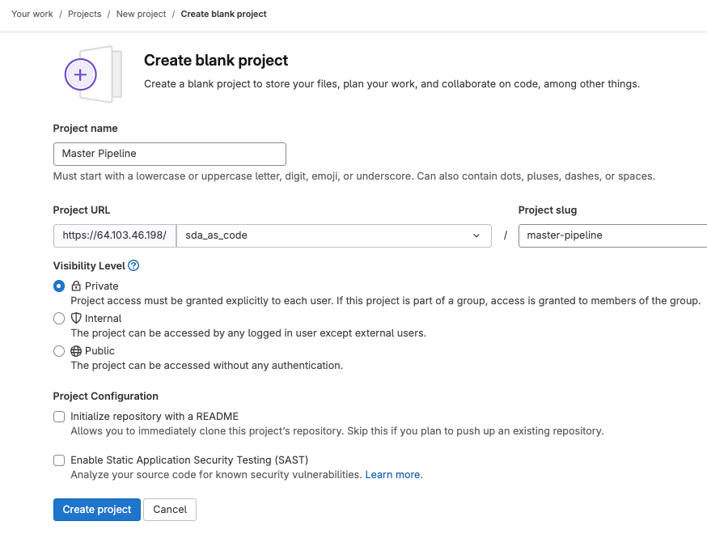
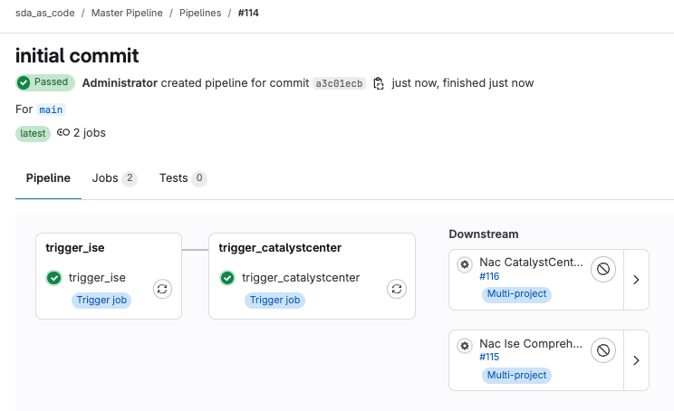
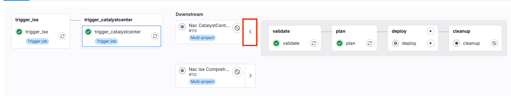
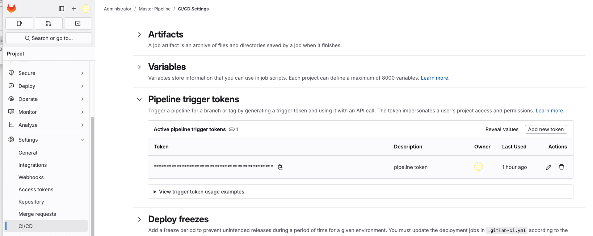
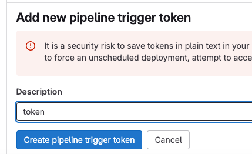
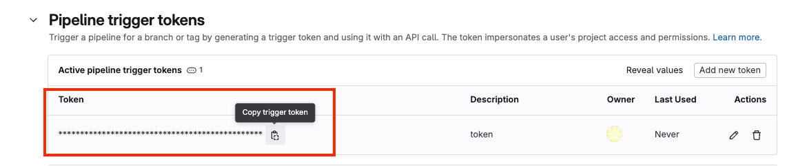
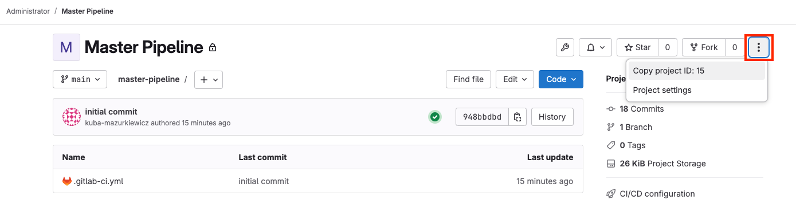
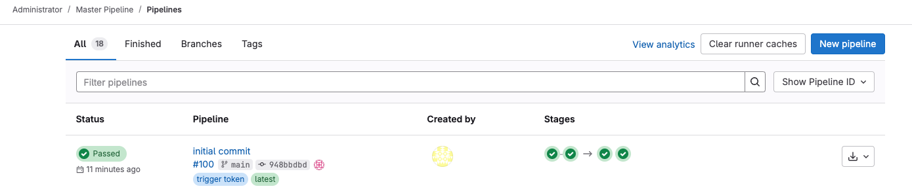
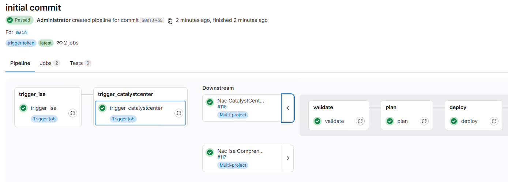

# Lab 6 (Optional) - Multiproject CICD Pipeline

!!! note
    Make sure you finish ([Lab 4 - CI/CD Integration](./lab4_cicd.md))

## Step 1: Create MultiProject CICD Pipeline

In Lab 4 - CI/CD Integration, two separate projects were created, each with its own CI/CD pipeline. This step focuses on creating a master pipeline and configuring a multi-project GitLab pipeline to manage and trigger pipelines for both CatalystCenter and ISE from a central location.

Log in to GitLab [link](https://198.18.133.101/projects/new). Create a new project and uncheck `Initialize repository with a README`:

```sh
Master Pipeline
```

<figure markdown>
  { width="800" }
</figure>

Start "Visual Studio Code" and open a new terminal by selecting `Terminal -> New Terminal` from the menu.

In the terminal window type the following command to clone the repository to your local machine:

```sh
git clone https://198.18.133.101/sda_as_code/master-pipeline.git
```

Create `.gitlab-ci.yml` file with following content:

```yaml
---
stages:
  - trigger_ise
  - trigger_catalystcenter

trigger_ise:
  stage: trigger_ise
  trigger:
    project: 'sda_as_code/nac-ise-comprehensive-example'
    branch: 'main'
  allow_failure: false

trigger_catalystcenter:
  stage: trigger_catalystcenter
  trigger:
    project: 'sda_as_code/nac-catalystcenter-comprehensive-example'
    branch: 'main'
  allow_failure: false
```

Save `.gitlab-ci.yml` file, commit changes and push to Gitlab:

```sh
git add .gitlab-ci.yml
git commit -m "initial commit"
git push
```

Pipeline Overview:

- **Triggering the CatalystCenter Pipeline** (trigger_catalystcenter)

    * This stage will trigger the pipeline in the sda_as_code/nac-catalystcenter-comprehensive-example project on the main branch.
    * The allow_failure: false setting ensures that if this pipeline fails, it will cause the master pipeline to fail.

- **Triggering the ISE Pipeline** (trigger_ise)

    * This stage will trigger the pipeline in the sda_as_code/nac-ise-comprehensive-example project on the main branch.
    * Similarly, allow_failure: false ensures the failure of this stage results in the failure of the entire master pipeline.

This setup ensures that the master pipeline can orchestrate the execution of pipelines across multiple GitLab projects. You can easily extend this to trigger additional child pipelines or control the sequence and behavior of triggers across different repositories.

Open the Master Pipeline Project in GitLab [link](https://198.18.133.101/sda_as_code/master-pipeline#). Once you’re in the project, go to the Build section from the left sidebar menu.
Select Pipelines under Build and inspect the pipeline. Click on the pipeline **Status** to view its details. You will see a breakdown of the pipeline stages and jobs.

<figure markdown>
  { width="600" }
</figure>

As you can see, the Master Pipeline triggered two downstream pipelines:

- Trigger CatalystCenter (trigger_catalystcenter): This triggers the pipeline for the `sda_as_code/nac-catalystcenter-comprehensive-example` project [link](https://198.18.133.101/sda_as_code/nac-catalystcenter-comprehensive-example)

- Trigger ISE (trigger_ise): This triggers the pipeline for the `sda_as_code/nac-ise-comprehensive-example` project [link](https://198.18.133.101/sda_as_code/nac-ise-comprehensive-example)

Click on `Expand jobs` next to both Downstream pipelines and review details of the `plan` stage. Since the pipelines were triggered from the master pipeline, the plan should indicate that there are **No Changes**.

<figure markdown>
  { width="800" }
</figure>

This multi-project pipeline structure allows you to maintain individual pipelines for CatalystCenter and ISE while providing an orchestration layer in the form of the master pipeline. The master pipeline can be triggered manually, automatically (via API), or by `.gitlab-ci.yml` configuration file changes.


Let's modify pipelines in `Nac CatalystCenter Comprehensive Example` and `Nac Ise Comprehensive Example` repositories to run deploy stage automatically when triggered from master pipeline. To do that edit `.gitlab-ci.yml` files in both repos by adding following rule under `deploy` job -> `rules`:

```yaml
    - if: '$CI_PIPELINE_SOURCE == "pipeline"'
      when: always   # Ensure this step is always executed when triggered by the master pipeline
```

!!! note
    Make sure to paste this rule above the rule for manual deploy.

***Nac Ise Comprehensive Example - .gitlab-ci.yml***

```yaml
...

deploy:
  stage: deploy
  script:
    - terraform init -input=false
    - terraform apply -input=false -auto-approve plan.tfplan
  dependencies:
    - plan
  needs:
    - plan
  rules:
    - if: '$CI_PIPELINE_SOURCE == "pipeline"'
      when: always   # Ensure this step is always executed when triggered by the master pipeline
    - if: '$CI_COMMIT_BRANCH == $CI_DEFAULT_BRANCH'
      when: manual

...
```

***Nac CatalystCenter Comprehensive Example - .gitlab-ci.yml***

```yaml
...

deploy:
  stage: deploy
  script:
    - terraform init -input=false
    - terraform apply -input=false -auto-approve plan.tfplan
  dependencies:
    - plan
  needs:
    - plan
  rules:
    - if: '$CI_PIPELINE_SOURCE == "pipeline"'
      when: always   # Ensure this step is always executed when triggered by the master pipeline
    - if: '$CI_COMMIT_BRANCH == $CI_DEFAULT_BRANCH'
      when: manual

...
```

Commit changes and push commits:

***Nac Ise Comprehensive Example***
    ```sh
    git add .gitlab-ci.yml
    git commit -m "modify gitlab-ci"
    git push
    ```

***Nac CatalystCenter Comprehensive Example***
    ```sh
    git add .gitlab-ci.yml
    git commit -m "modify gitlab-ci"
    git push
    ```

## Step 2: Triggering Pipelines Using API

To trigger master pipeline via API call, follow steps:

- Create `Pipeline trigger token`, by opening Project in GitLab: [https://198.18.133.101/sda_as_code/master-pipeline](https://198.18.133.101/sda_as_code/master-pipeline) and navigate to `Settings` > `CI/CD` on left pane, and expand `Pipeline trigger tokens` and click `Add new token`

<figure markdown>
  { width="800" }
</figure>

- Fill in the `Description` field, then click: `Create pipeline trigger token`

<figure markdown>
  { width="300" }
</figure>

- Click on `Copy trigger token` and save token value

<figure markdown>
  { width="800" }
</figure>

- Find project ID of `master-pipeline` project. To find Project ID, open your project in GitLab, and click three dots on the top right corner:

<figure markdown>
  { width="800" }
</figure>

- Run following command in your Windows terminal:

```cli
curl.exe -k --request POST --form "token=<TOKEN>" --form "ref=main" "https://198.18.133.101/api/v4/projects/<PROJECT_ID>/trigger/pipeline"
```

Replace `<PROJECT_ID>` and `<TOKEN>` with your values.

Example:

```cli
curl.exe -k --request POST --form "token=glptt-c0653156fb1b01fc12e4096a8643f395f188383c" --form "ref=main" "https://198.18.133.101/api/v4/projects/15/trigger/pipeline"
```

You should see following response after running that command:

```cli
C:\Users\admin>curl.exe -k --request POST --form "token=glptt-c0653156fb1b01fc12e4096a8643f395f188383c" --form "ref=main" "https://198.18.133.101/api/v4/projects/15/trigger/pipeline"
{"id":100,"iid":18,"project_id":15,"sha":"948bbdbd0d677595c128a247b9d195177d88e409","ref":"main","status":"created","source":"trigger","created_at":"2025-01-21T12:23:50.860Z","updated_at":"2025-01-21T12:23:50.860Z","web_url":"https://198.18.133.101/sda_as_code/master-pipeline/-/pipelines/100","before_sha":"0000000000000000000000000000000000000000","tag":false,"yaml_errors":null,"user":{"id":1,"username":"root","name":"Administrator","state":"active","locked":false,"avatar_url":"https://secure.gravatar.com/avatar/4a277fdf7148ade83b6749e46e37ef02f2d6bf4ec5ef442466a29242393befb6?s=80\u0026d=identicon","web_url":"https://198.18.133.101/root"},"started_at":null,"finished_at":null,"committed_at":null,"duration":null,"queued_duration":null,"coverage":null,"detailed_status":{"icon":"status_created","text":"Created","label":"created","group":"created","tooltip":"created","has_details":false,"details_path":"/sda_as_code/master-pipeline/-/pipelines/100","illustration":null,"favicon":"/assets/ci_favicons/favicon_status_created-4b975aa976d24e5a3ea7cd9a5713e6ce2cd9afd08b910415e96675de35f64955.png"}}
C:\Users\admin>
```

Open the project in GitLab and navigate to `Build` > `Pipelines` and find the latest pipeline. Notice that there is a tag `trigger token` which means that pipeline was automatically triggered by API call.

<figure markdown>
  { width="800" }
</figure>

Click on the pipeline **Status** to view its details. Then, expand jobs in both downstream pipelines and verify that the `deploy` stage was executed in both pipelines according to the rules configured to automatically execute the deploy stage when triggered by the master pipeline.

<figure markdown>
  { width="800" }
</figure>
