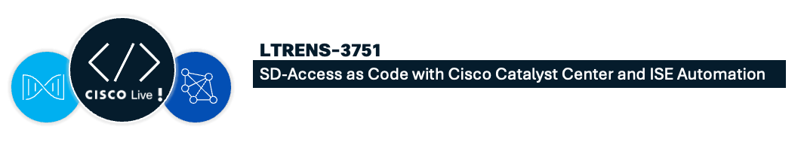
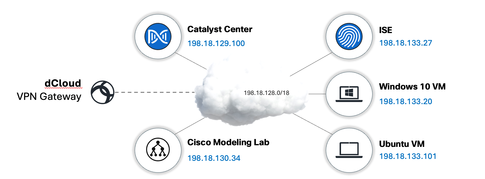
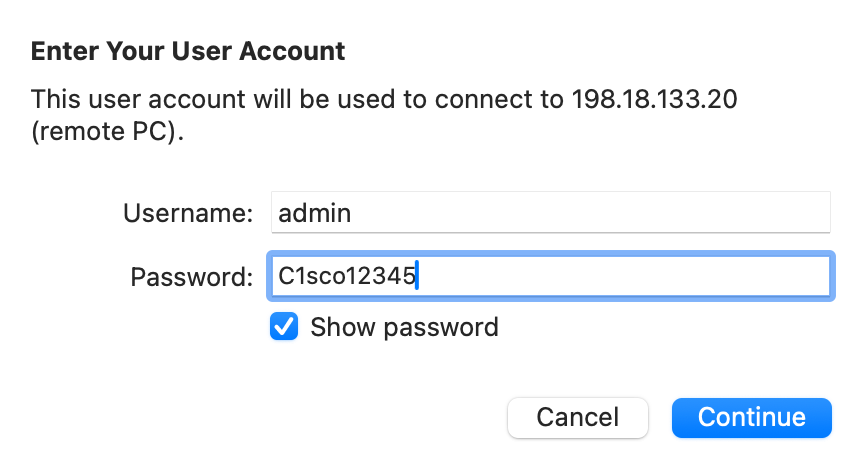

# Overview

<left>
  { width=80% }
</left>

## Learning Objectives

This lab will give you an introduction to managing SD-Access with Cisco Catalyst Center and Cisco Identity Services Engine (ISE) using "as Code" methodology. Our modern cloud networking products and controllers have been designed with automation being top of mind. SD-Access as Code is aimed at users with limited experience with Terraform, or those that prefer automating through an inventory driven approach.

The majority of the project is aimed at leveraging a data model driven approach through Hashicorp Terraform. Terraform is commonly used to define cloud and on-prem resources in human-readable configuration, that you can version, reuse and share.

SD-Access as Code allows for complete separation of data (defining variables) from logic (infrastructure declaration). With little to no experience with automation, users can instantiate network fabrics in minutes. The model is designed to logically mirror the GUI, eliminating the complexity of managing references, dependencies, or loops. This approach will feel intuitive to those accustomed to operating through the GUI.

## Disclaimer

Although the lab design and configuration examples could be used as a reference, for design related questions please contact your representative at Cisco, or a Cisco partner.

    
## Lab Overview 
This lab is **fully virtualized**, and all components are in a virtual form factor, including the *Catalyst Center*, *ISE Server* and the *Catalyst 9000 switches* simulated in the CML (Cisco Modeling Lab) environment.

The main management IP subnet that will be used throughout the lab to establish connections with the individual components is *198.18.128.0/18*, and all devices have a management IP assigned from this subnet.
 
| Device Name | Management IP: | Username:	| Password: | Interface:|
|-------------|-----------------|-----------| ----------| -------|
| *Catalyst Center* | 198.18.129.100 | ```admin``` | ```C1sco12345``` | [web](https://198.18.129.100){ .md-button } |
| *ISE*             | 198.18.133.27  | ```admin``` | ```C1sco12345``` | [web](https://198.18.133.27){ .md-button } |
| *Cisco Modeling Lab* | 198.18.130.34 | ```guest``` | ```CiscoLive``` |[web](https://198.18.130.34){ .md-button } |
| *Windows VM* | 198.18.133.20 | ```admin``` | ```C1sco12345``` | [rdp](rdp://198.18.133.20){ .md-button } |
| *Ubuntu VM* | 198.18.133.101 | ```guest``` | ```CiscoLive``` | [ssh](ssh://guest@198.18.133.101){ .md-button } |
| *GitLab* | 198.18.133.101 | ```root``` | ```C1sco12345``` | [web](https://198.18.133.101){ .md-button } |

<center>
  { width=80% }
</center>


## Lab Access

!!! info inline end "Note:"

    Each workstation has a unique **POD number** assigned along with **VPN credentials**.
    Using incorrect VPN credentials may result in configuring someone else's lab !
    
Using the **Instructor-Led Lab Assistant**, establish a VPN connection to your assigned POD.<br>
If you do not know your POD number, please contact your proctor.

    
After establishing the VPN connection with your POD:

From your lab workstation, open a [RDP](rdp://198.18.133.20) (Remote Desktop Protocol) session to the Windows VM:

- IP: ```198.18.133.20```
- Username: ```admin```
- Password: ```C1sco12345```

<figure class="center-image" markdown>
  { width=40% }
</figure markdown>

The Windows VM will be used as a jump station to perform all the subsequent steps.<br>
All the required tools, applications, and settings have already been preconfigured on the workstation.

<figure class="center-image" markdown>
  { width=80% }
</figure markdown>

Make sure that you can establish the RDP session.

## Getting Started

Read through the SD-Access as Code [Introduction](introduction.md) to ensure you understand how SD-Access as Code works. You can also find additional information on Network as Code [website](https://netascode.cisco.com/). This step is optional but is recommended. The labs can be followed in any order, but it is highly recommended to at least complete Lab 1 first.